class: center, middle, inverse

# Evaluation of Deep Reinforcement Learning algorithms in Rich and Complex Environments for Continuous Control
[Msc. Candidate: Wilbert Pumacay]
 
 
[Advisor: Dr. Jose Ochoa Luna]

---

<!-- logo -->
.logo[]

## AGENDA

.slide_text_content[
*   Problem formulation
*   Proposal
*   State of the Art
*   Current progress
]

---
class: center, middle, inverse
# Problem formulation

---

<!-- logo -->
.logo[]

## Robot Locomotion

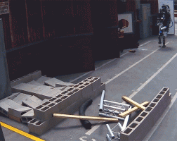

DARPA robotics challenge (2015)

---

<!-- logo -->
.logo[]

## Robot Locomotion

DARPA robotics challenge (2015)

---

class: center, middle
# The problem (1): Robot locomotion is HARD!

.logo[]

---

<!-- logo -->
.logo[]

## Robot Locomotion

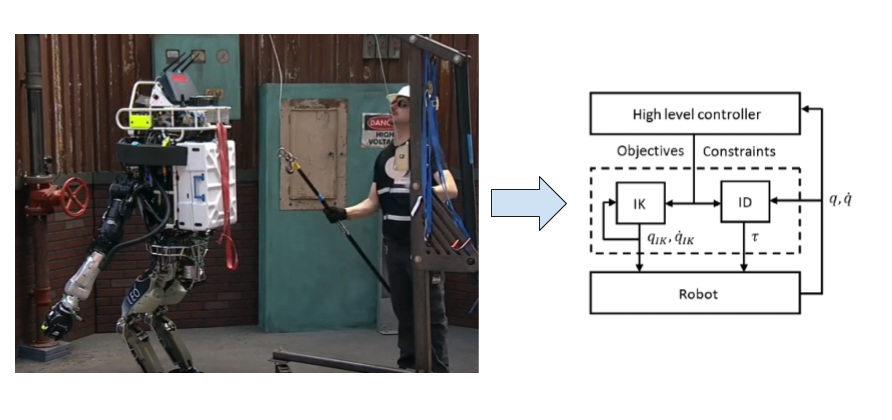

Feng, et al. [13]

---

<!-- logo -->
.logo[]

## Robot Locomotion

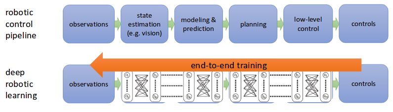

Feng, et al. [13]

Extracted from DeepRL course cs294, Berkeley [14]

---

class: center, middle
# The approach (1): Try using DeepRL to solve locomotion

.logo[]

---

<!-- logo -->
.logo[]

## RL Background

.slide_text_content[
RL is a learning approach in which an agent **learns by interaction** with the environment. By each interaction the agent makes with the environment (by taking **actions**), the agent ends up in a different state (because of the **environment dynamics**) and receives a **reward** from the environment according to this transition.
]

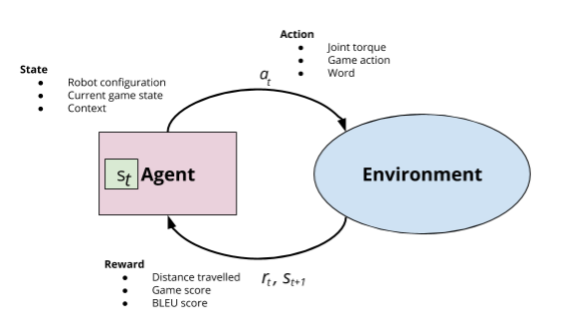

Extracted from Sutton and Barto, Reinforcement learning book [1]

---

<!-- logo -->
.logo[]

## RL Background

.slide_text_content[
RL is a learning approach in which an agent **learns by interaction** with the environment. By each interaction the agent makes with the environment (by taking **actions**), the agent ends up in a different state (because of the **environment dynamics**) and receives a **reward** from the environment according to this transition.
]

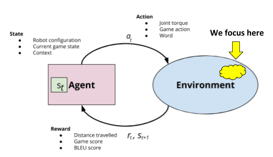

Extracted from Sutton and Barto, Reinforcement learning book [1]

---

<!-- logo -->
.logo[]

## Learning environments

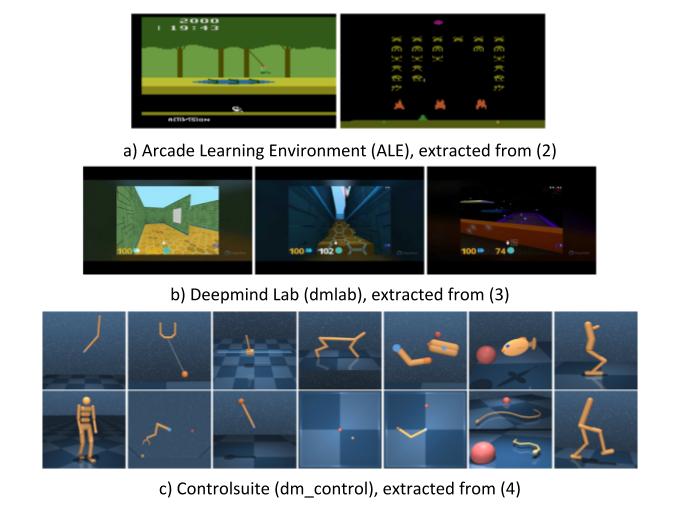

---

<!-- logo -->
.logo[]

## Learning environments - locomotion

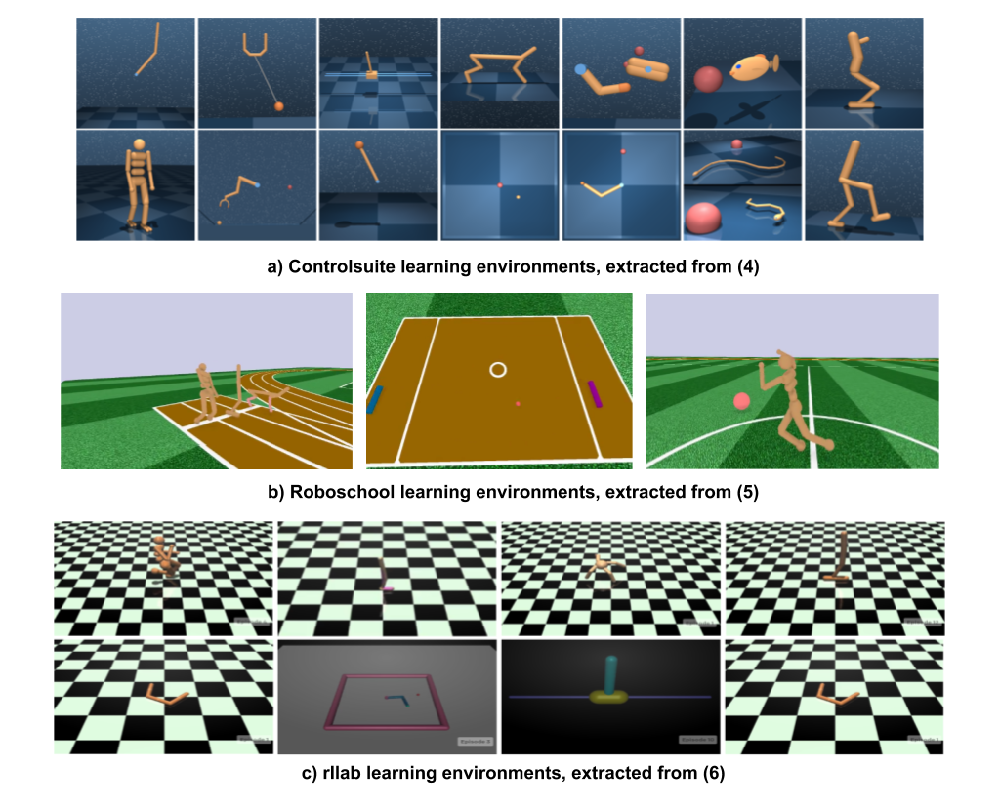

---

<!-- logo -->
.logo[]

## Learning environments - locomotion

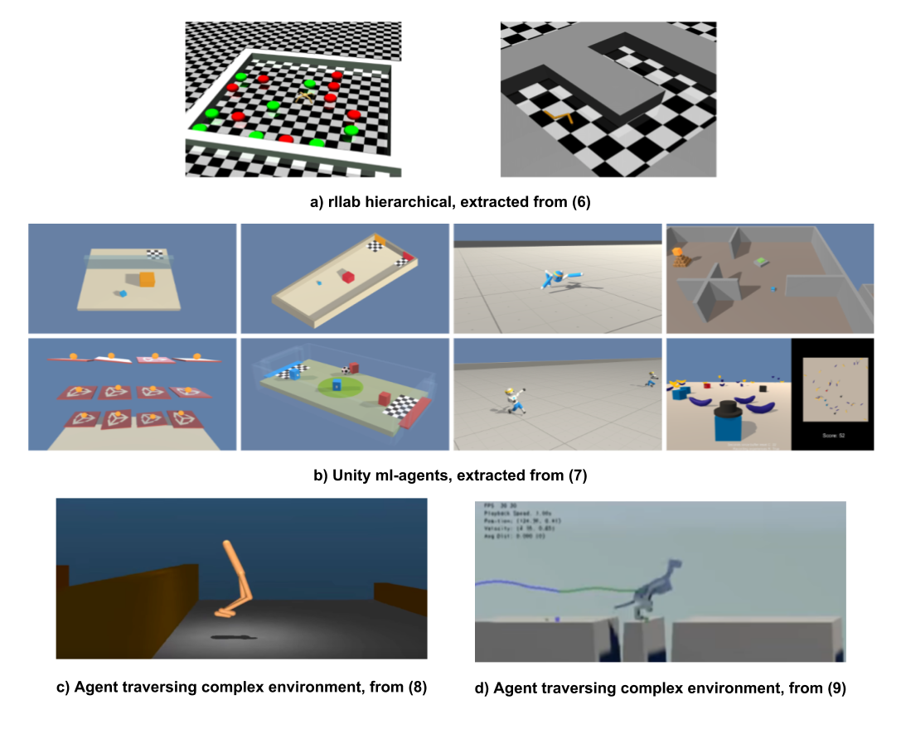

---

<!-- logo -->
.logo[]

## Learning environments - locomotion

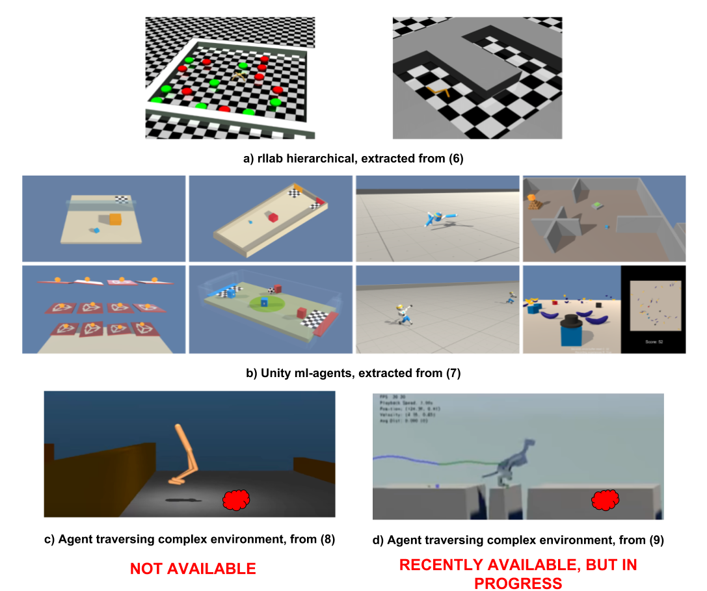

---

class: center, middle
# The problem (2): There are not enough tools to solve the problem

.logo[]

---

class: center, middle, inverse
# Proposal

---

<!-- logo -->
.logo[]

## Proposal

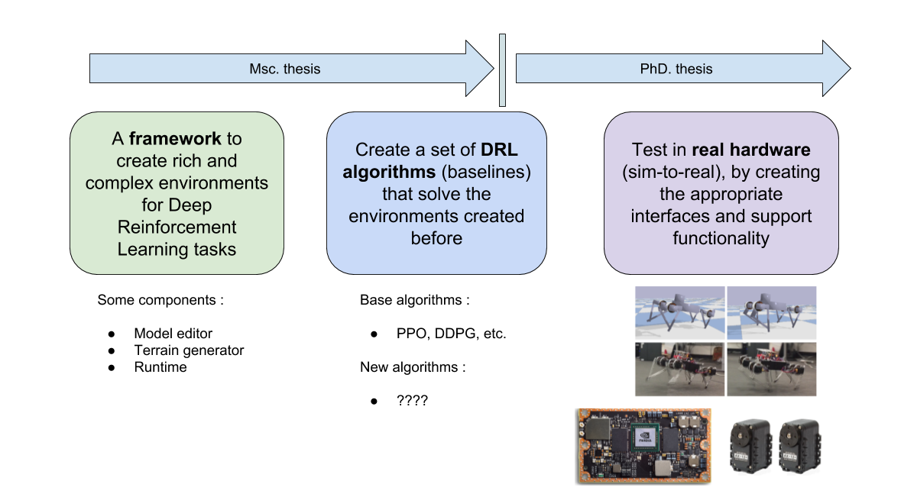

(a) Sim-to-real, from Tan et al. [15]

(b) Jetson TX2 platform from NVIDIA

(c) Dynamixel motors

(a)

(b)

(c)

---

<!-- logo -->
.logo[]

## Proposal : Framework

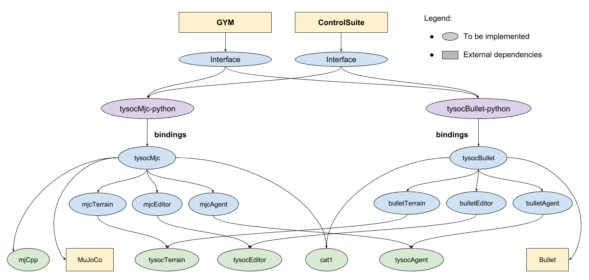

---

<!-- logo -->
.logo[]

## Proposal : Baselines

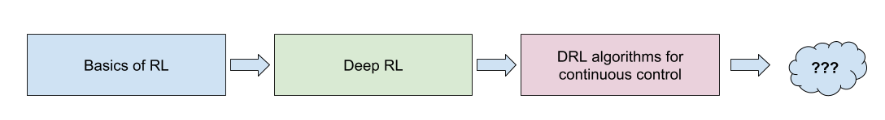

---

class: center, middle, inverse
# State of the art

---

<!-- logo -->
.logo[]

## State of the art

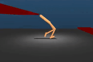

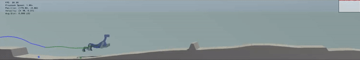

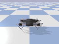

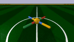

a) Walker traversing terrain, from [8]

b) Dog traversing terrain, from [10]

c) Agents from the <b>tfagents</b> package, from [11]

---

class: center, middle, inverse
# Current Progress

---

<!-- logo -->
.logo[]

##  Model Editor + Terrain Generator

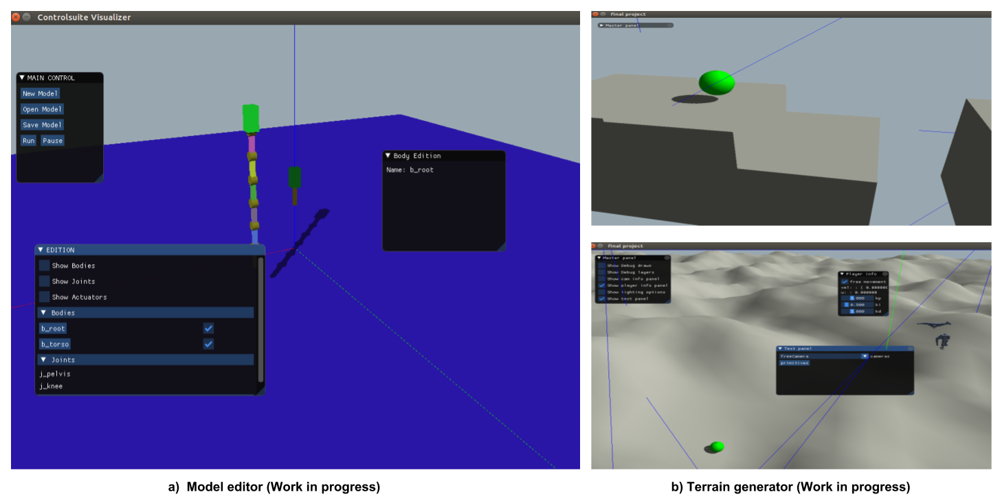

---

<!-- logo -->
.logo[]

##  Model Editor + Terrain Generator

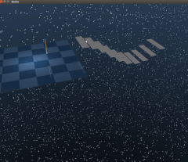

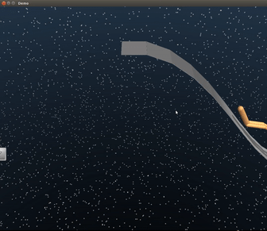

WIP: Terrain generator on top of the MuJoCo physics engine [12]

---

<!-- logo -->
.logo[]

## Proposed framework: Poster invitation

.slide_text_content[
Invited to present at a workshop in Canada, on Dec. 8 this year. The organizers are the group **LatinxinAI**.
]

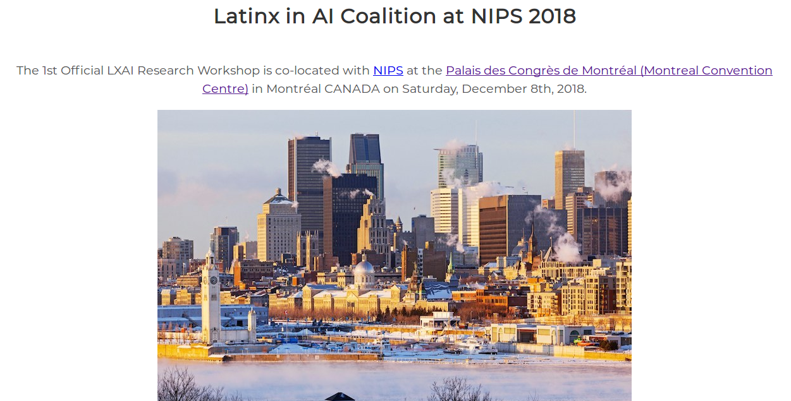

---

<!-- logo -->
.logo[]

## Baselines: WIP with extra course

.slide_text_content[
I'm enrolled (paid the fee) for a course in Deep Reinforcement Learning from **Udacity**, called, **Deep Reinforcement Learning Nanodegree**, which I'm using to get to the level I need to implement the baselines.
]

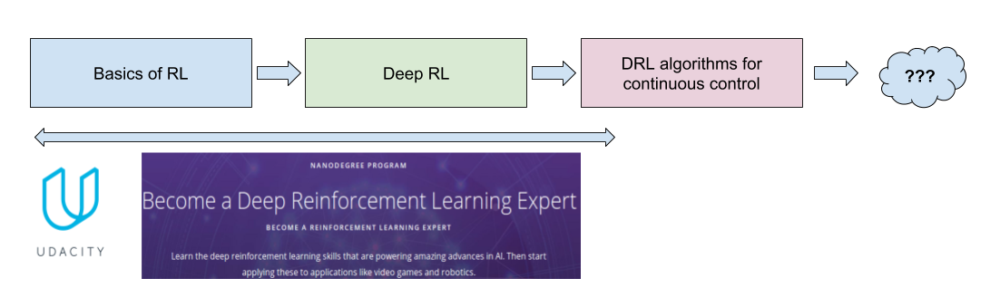

---

class: center, middle, inverse
# References

---

<!-- logo -->
.logo[]

## References

.slide_text_content[
*   [1] Richard S. Sutton, Andrew G. Barto. Reinforcement Learning: An Introduction. MIT Press - 2017.
*   [2] Bellemare, et al. The Arcade Learning Environment: An Evaluation Platform for General Agents. IJCAI - 2015.
*   [3] Charles Beattie, et al. DeepMind Lab. ArXiv - 2016.
*   [4] Yuval Tassa, et al. DeepMind Control Suite. ArXiv - 2018.
*   [5] OpenAI. Roboschool. https://github.com/openai/roboschool.
*   [6] Yan Duan, Xi Chen, et al. Benchmarking Deep Reinforcement Learning for Continuous Control. ICML - 2016.
*   [7] Juliani, A., et al. Unity: A General Platform for Intelligent Agents. ArXiv - 2018.
]

---

<!-- logo -->
.logo[]

## References

.slide_text_content[
*   [8] Nicolas Heess, et al. Emergence of Locomotion Behaviours in Rich Environments. ArXiv - 2017.
*   [9] Xue Bin Peng, et al. Terrain-Adaptive Locomotion Skills Using Deep Reinforcement Learning. Proc. SIGGRAPH - 2016.
*   [10] Glen Berseth, et al. Terrain RL simulator. ArXiv - 2018.
*   [11] Danijar Hafner, et al. Tensorflow Agents: Efficient Batched Reinforcement Learning in Tensorflow. ArXiv - 2017.
*   [12] MuJoCo physics engine. https://mujoco.org
*   [13] Siyuan Feng, et al. Optimization-based Full Body Control for the DARPA Robotics Challenge. Journal of Field Robotics, Volume 32, Issue 2, pages 293-312, 2015.
*   [14] cs294: Deep Reinforcement Learning course. http://rail.eecs.berkeley.edu/deeprlcourse/ . Berkeley - 2018.
*   [15] Jie Tan, et al. Sim-to-Real: Learning Agile Locomotion For Quadruped Robots. RSS - 2018.
]

---

class: center, middle, inverse
# Thanks