count: false
class: center, middle

# Evaluation of Deep Reinforcement Learning algorithms in Rich and Complex Environments for Locomotion Tasks

 
Author: Wilbert Santos Pumacay Huallpa
 
 
Advisor: José Eduardo Ochoa Luna

---

## OUTLINE

*   Motivation
*   Background
*   Related works
*   Proposal
*   Current Progress
*   Preliminary conclusions

---
count: false
class: center, middle, inverse
# Motivation

---

## DeepRL success stories

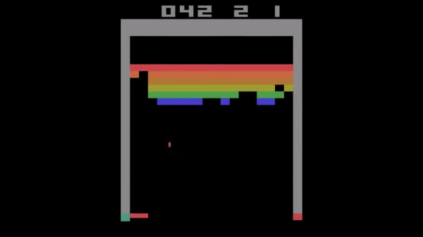
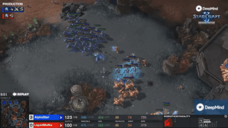

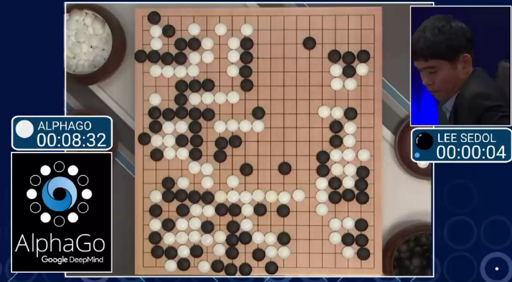

---

## DeepRL in locomotion and manipulation

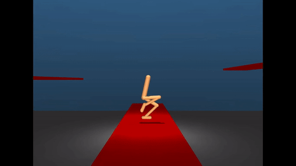
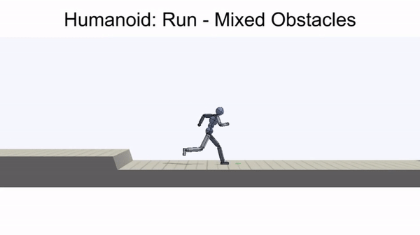

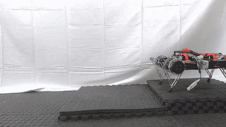
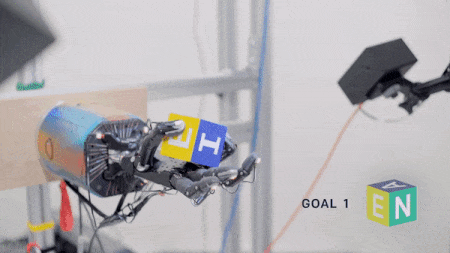

---

## The Problem

--

*   Current locomotion benchmarks allow to train agents in simulated environments
    based on popular physics engines.

--

*   However, these benchmarks do not offer more diverse and complex environments,
    and mostly consist of relatively simple environments.

--

---

## The Solution

--

*   We will focus on making the required infrastructure and support to
    allow researchers to build diverse and complex environments.

--

*   To do so, we propose to build a full locomotion framework from scratch, 
    using only widely used physics engines as core dependencies.

--

*   Also, we focus on evaluating current state-of-the-art DeepRL algorithms
    in a new benchmark consisting of tasks built using the proposed framework.

---

## The Solution

---

count: false
class: center, middle, inverse
# Background

---

## Reinforcement Learning (RL)

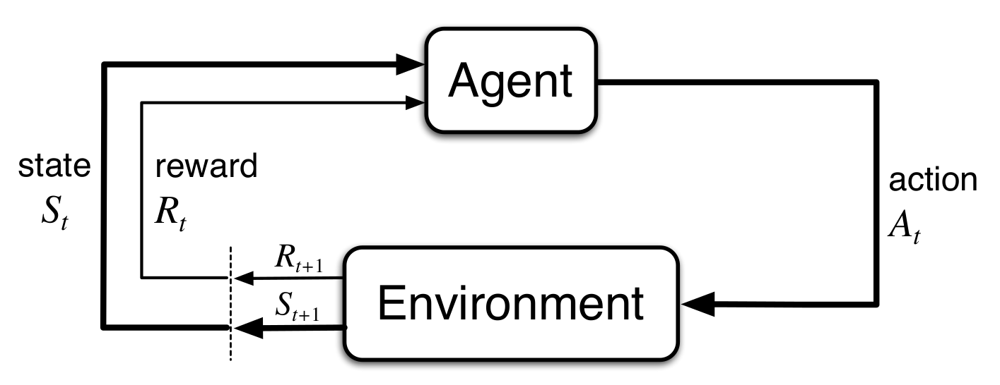

--

*   RL is a learning approach in which an agent learns by interaction with an environment.

--

*   The agent configuration is given by a state \\( s_t \\).

--

*   Then, the agent interacts by means of actions \\( a_t \\)

--

*   As a result, the agent gets a reward \\( r_{t+1} \\) for that interaction.

---

exclude: true

## Learning Representations (Deep Learning)

--

exclude: true

*   Deep Learning allows us to learn useful representation by using deep models
    trained end-to-end, instead of handcrafting the required features for a given task.

--

exclude: true

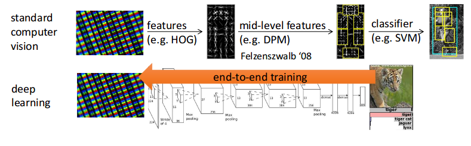

---

exclude: true

## Deep Reinforcement Learning (DeepRL)

--

exclude: true

*   By combining Reinforcement Learning with deep learning models we can learn to take
    decisions directly from raw sensory inputs, without handcrafting features, e.g. learn
    to play a video game from frames as inputs, and acting directly with the gamepad actions.

--

exclude: true

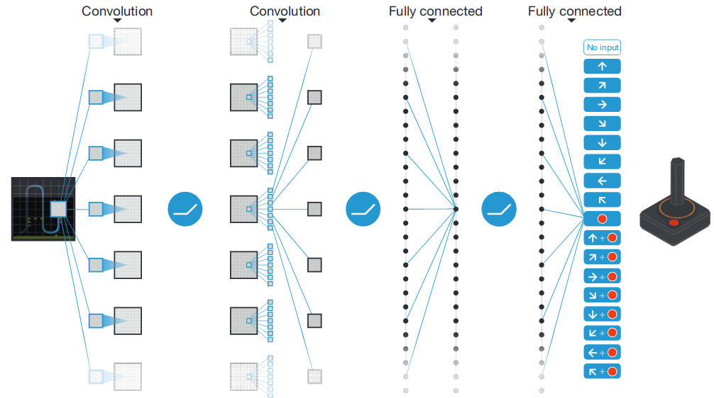

---

exclude: true

## Learning behaviours end-to-end

--

exclude: true

*   By using DeepRL we can train agents end-to-end in a very different approach to
    traditional pipelines, e.g. for robotics we could train agents without crafting
    separate modules of a traditional robotics pipeline.

--

exclude: true

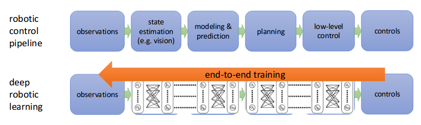

---

exclude: true

## DeepRL

--

exclude: true

*   Deep models (whose parameters we represent by \\( \theta \\)) can be used to 
    parameterize various components of the RL problem.

--

exclude: true

*   The State-Value and Action-Value functions: 
    *   \\( V_\theta (s) \\)
    *   \\( Q_\theta (s,a) \\)

--

exclude: true

*   The Policy :
    *   Deterministic: \\( a = \pi_{\theta}(s) \\)
    *   Stochastic: \\( a \sim \pi_{\theta}(.|s) \\)

--

exclude: true

*   The Model:
    *   \\( s' = f_\theta (s, a) \\)

---

## DeepRL

*   DeepRL = Deep Learning + Reinforcement Learning

--

*   Deep models (whose parameters we represent by \\( \theta \\)) can be used to 
    parameterize various components of the RL problem.

--

*   The baselines we will focus on deal mainly with parameterized policies

--

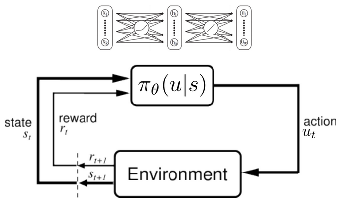

---

## Solution methods

--

*   Below we show a taxonomy of current DeepRL algorithms, separated between
    model-free and model-based. 

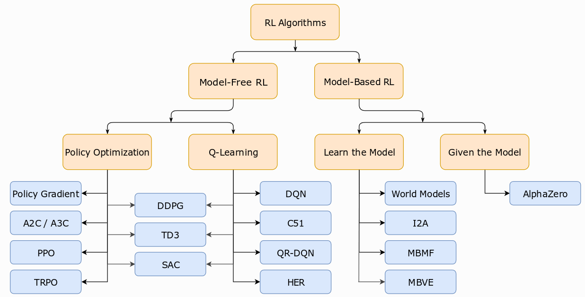

<!--.footnote[.red[>] Image taken from SpinningUp in RL [course](https://spinningup.openai.com/en/latest/) by OpenAI]-->

--

*   The baselines we will use belong to the **Policy Optimization** class of algorithms,
    and are highlighted below.

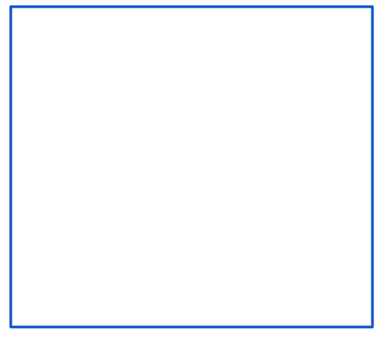

---

exclude: true

## Policy Optimization

--

exclude: true

*   We focus on policy optimization algorithms, which try to learn the parameters
    \\( \theta \\) of a parameterized policy \\( \pi_{\theta} \\) such that it maximizes
    the following expected return:

.center[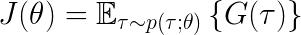]

--

exclude: true

*   The **Vanilla Policy Gradients** algorithm updates the weights \\( \theta \\)
    of the policy by computing an estimate \\( \hat g \\) of the gradient of 
    the loss function from above (refer to section 2.1.3 for more details):

.center[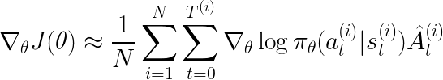]

---

## Simulated environments

---

count: false

## Simulated environments

*   These consists of simulations, which serve as learning environments for our RL agents.
    Some such environments are shown below:

---

layout: true

## Simulated environments

*   These consists of simulations, which serve as learning environments for our RL agents.
    Some such environments are shown below:

---

count: false

*   The Atari Learning Environment (ALE), consist of an interface to Atari 2600
    games. The API exposes as observations the raw frames of the game, and as 
    actions the available actions for an Atari gamepad.

---

count: false;

*   Gym (by OpenAI) consists of a set of environments in various domains, from
    simple toy-text problems, to complex robotic manipulation simulations.

---

count: false
layout: false
class: center, middle, inverse
# Related works

---

count: false
class: center, middle
# DeepRL algorithms used in locomotion (section 3.1)

---

## Trust Region Policy Optimization (Schulman et. al. (2015))

<iframe src="https://www.youtube.com/embed/jeid0wIrSn4" 
        frameborder="0" allow="accelerometer; autoplay; encrypted-media; gyroscope; picture-in-picture" allowfullscreen
        style="position: absolute; top: 30%; left: 10%; width: 80%; height: 60%"></iframe>

---

## Proximal Policy Optimization (Schulman et. al. (2017))

<iframe src="https://d4mucfpksywv.cloudfront.net/openai-baselines-ppo/knocked-over-stand-up.mp4"
        frameborder="0" allow="accelerometer; autoplay; encrypted-media; gyroscope; picture-in-picture" allowfullscreen
        style="position: absolute; top: 40%; left: 5%; width: 45%; height: 30%"></iframe>

<iframe src="https://d4mucfpksywv.cloudfront.net/openai-baselines-ppo/atlas.mp4"
        frameborder="0" allow="accelerometer; autoplay; encrypted-media; gyroscope; picture-in-picture" allowfullscreen
        style="position: absolute; top: 40%; left: 55%; width: 45%; height: 30%"></iframe>

---

exclude: true

## Soft Actor-Critic (Haarnoja et. al. (2018))

*   Desc. 1
*   Desc. 2

<iframe src="https://www.youtube.com/embed/FmMPHL3TcrE?start=48" 
        frameborder="0" allow="accelerometer; autoplay; encrypted-media; gyroscope; picture-in-picture" allowfullscreen
        style="position: absolute; top: 50%; left: 5%; width: 40%; height: 30%"></iframe>

<iframe src="https://www.youtube.com/embed/KOObeIjzXTY" 
        frameborder="0" allow="accelerometer; autoplay; encrypted-media; gyroscope; picture-in-picture" allowfullscreen
        style="position: absolute; top: 50%; left: 55%; width: 40%; height: 30%"></iframe>

---

count: false
class: center, middle
# Recent DeepRL results in locomotion (section 3.2)

---

## Benchmarking DeepRL for Continuous control (Duan et. al. (2016))

*   **Evaluated** various RL algorithms (up to TRPO and DDPG) for 
    control tasks, ranging from simple control tasks, to more
    complicated locomotion tasks.

--

*   Introduced a benchmark called **rllab**, which is still used
    as a benchmark to test DeepRL algorithms in locomotion tasks.

--

*   Our proposal tries to essentially **make a similar study**, by 
    proposing a new benchmark and evaluating current DeepRL algorithms.

---

## Benchmarking DeepRL for Continuous control (Duan et. al. (2016))

---

## DeepTerrainRL (Peng et. al. (2016))

*   Trained agents to traverse complex terrain by using DeepRL over
    a parameterized FSM controller.

*   The authors developed their own platform for their experiments, based
    on the Bullet physics engine, and used in various articles from 2015
    to this year.

<iframe src="https://www.youtube.com/embed/KPfzRSBzNX4?start=59" 
        frameborder="0" allow="accelerometer; autoplay; encrypted-media; gyroscope; picture-in-picture" allowfullscreen
        style="position: absolute; top: 50%; left: 25%; width: 50%; height: 40%"></iframe>

---

## DeepLoco (Peng et. al. (2017))

*   A follow-up from the work mentioned previously.

*   Trained a hierarchical controller to complete more complicated tasks.

<iframe src="https://www.youtube.com/embed/G4lT9CLyCNw?start=11" 
        frameborder="0" allow="accelerometer; autoplay; encrypted-media; gyroscope; picture-in-picture" allowfullscreen
        style="position: absolute; top: 40%; left: 20%; width: 60%; height: 50%"></iframe>

---

## Emergence of locomotion behaviours (Heess et. al. (2017))

*   Trained agents from scratch (tabula rasa) to traverse obstacle
    courses of varying difficulty (unlike previous works).

*   The environment was created with curricula that increasingly 
    adjusted the difficulty of the environment.

<iframe src="https://www.youtube.com/embed/hx_bgoTF7bs?start=11" 
        frameborder="0" allow="accelerometer; autoplay; encrypted-media; gyroscope; picture-in-picture" allowfullscreen
        style="position: absolute; top: 55%; left: 22.5%; width: 50%; height: 40%"></iframe>

---

count: false
class: center, middle
# DeepRL benchmarks for locomotion (section 3.3)

---

## A whole zoo of benchmarks

--

*   OpeanAI-Gym + [MuJoCo-py](https://github.com/openai/mujoco-py)

--

*   OpenAI-Gym + [Roboschool](https://blog.openai.com/roboschool/)

--

*   Deepmind's [Controlsuite](https://github.com/deepmind/dm_control)

--

*   [Rllab](https://github.com/rll/rllab) and [Garage](https://github.com/rlworkgroup/garage)

--

*   [Robosuite](https://github.com/StanfordVL/robosuite)

--

*   NVIDIA's [Gpu-Accelerated Simulator](https://sites.google.com/view/accelerated-gpu-simulation/home)

--

*   [TerrainRLSim](https://www.cs.ubc.ca/~gberseth/blog/terrainrl-sim.html)

--

*   [Unity ML-Agents](https://github.com/Unity-Technologies/ml-agents)

--

*   ...

---

count: false
class: center, middle, inverse
# Proposal

---

## Overview

--

*   Develop a **framework** for locomotion tasks, analogous to a 
    Game Engine. This would allow us to have full control over
    the tasks we can create.

--

*   Create a **new benchmark** with this framework, consisting of
    a wide range of environments ranging from low to high complexity.

--

*   **Evaluate** current DeepRL algorithms in this benchmark, in order
    to explore the upsides and downsides of these algorithms.

--

*   The scope of this thesis will cover:

    *   Development of the a core backend-agnostic framework

    *   Support for multiple physics backends

    *   APIs for environment creation via procedural terrain generation
        and static scenes.

    *   A set of baselines tested in our framework.

---

## A long-term goal

--

*   The ultimate goal we tried to pursue was to be able to transfer learned
    policies into real-world platforms.

--

*   To achieve this, we consider that we will need to have full control 
    over our research platform.

--

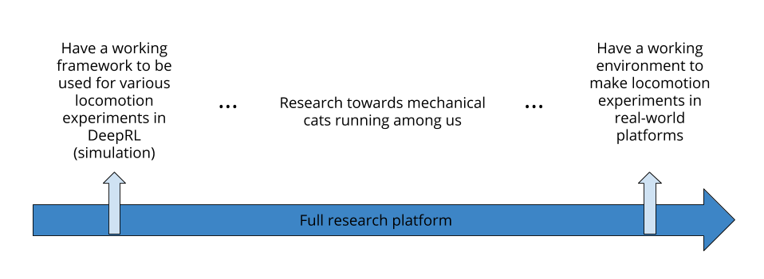

---

## A measure of intelligence

--

*   We based our objective on the measure of intelligence proposed by 
    *Legg and Marcus (2007)*.

--

--

*   Intuitively, we measure the performance in a wide range of tasks, and
    weight them by a factor that decreases with complexity.

--

*   Thus, our efforts go into supporting the creation of a wide set of
    tasks with varying complexity.

---

## Curricula learning

--

*   As described by *Bengio et. al. (2009)*, the order in which we 
    present the data to our models during training affects the final
    training results.

--

*   This idea was used by *Heess et. al. (2017)* to train their agents
    in a increasingly more difficult environment.

--

*   Our proposal includes support for the creation of this type of
    environments via the appropiate APIs that use procedural terrain
    generation.

--

*   To achieve this we parameterize our terrain generators and control
    these parameters as needed.

---

## Why not use an existing codebase?

--

*   As far as we have checked we haven't found a codebase we could work
    with that satisfies our requirements:

    *   Support for multiple swappable backends (no extra compilation).

    *   Fully open source.

    *   Extensible and stable.

    *   Documented and supported.

--

*   What about Gazebo-ROS and V-Rep?. Still, we consider them not the best
    option for our requirements.

---

## Technical details: Backend support

--

*   The core functionality serves as a backend-independent
    abstract simulation. 

--

*   It's abstract in the sense that it can't be simulated until
    we instantiate a specific backend.

--

*   This is similar to how Tensorflow and PyTorch handle instantiation
    of the required backend for computation.

--

*   We define an abstract scenario that contains the abstract agents,
    terrain generators, and sensors (analogous to a computation graph).

--

*   Once we need to simulate the given scenario, we just instantiate
    with a given backend.

---

## Technical details: Instantiation process

---

## Technical details: Framework architecture

---

## Technical details: Agents core functionality

---

## Technical details: Terrain generators core functionality

---

## Technical details: Sensors functionality

---

count: false
class: center, middle, inverse
# Current Progress

---

## Framework: Agents

<iframe src="https://www.youtube.com/embed/5zv5SK0o92I" 
        frameborder="0" allow="accelerometer; autoplay; encrypted-media; gyroscope; picture-in-picture" allowfullscreen
        style="position: absolute; top: 30%; left: 10%; width: 80%; height: 60%"></iframe>

---

## Framework: Terrain - proof of concept

<iframe src="https://www.youtube.com/embed/xWdNFGlhlOA" 
        frameborder="0" allow="accelerometer; autoplay; encrypted-media; gyroscope; picture-in-picture" allowfullscreen
        style="position: absolute; top: 30%; left: 10%; width: 80%; height: 60%"></iframe>

---

## Framework: Sensors - heightfields

<iframe src="https://www.youtube.com/embed/-EJMER5AGRQ" 
        frameborder="0" allow="accelerometer; autoplay; encrypted-media; gyroscope; picture-in-picture" allowfullscreen
        style="position: absolute; top: 30%; left: 10%; width: 80%; height: 60%"></iframe>

---

## Framework: Sensors - agent internals

<iframe src="https://www.youtube.com/embed/c0R81VBZ72o" 
        frameborder="0" allow="accelerometer; autoplay; encrypted-media; gyroscope; picture-in-picture" allowfullscreen
        style="position: absolute; top: 30%; left: 10%; width: 80%; height: 60%"></iframe>

---

## Framework: Python-bindings + dynamic loading

<iframe src="https://www.youtube.com/embed/_YWrLDPcmzI" 
        frameborder="0" allow="accelerometer; autoplay; encrypted-media; gyroscope; picture-in-picture" allowfullscreen
        style="position: absolute; top: 30%; left: 10%; width: 80%; height: 60%"></iframe>

---

## Framework: Supported Agents

<iframe src="https://www.youtube.com/embed/PkgI0pIz4nM" 
        frameborder="0" allow="accelerometer; autoplay; encrypted-media; gyroscope; picture-in-picture" allowfullscreen
        style="position: absolute; top: 30%; left: 10%; width: 80%; height: 60%"></iframe>

---

count: false
class: center, middle, inverse
# Preliminary conclusions

---

## Preliminary Conclusions

*   Difficulty in the engineering aspect, and so far there are no 
    related works that follow our approach.

--

*   Several issues might arrive during evaluation, so follow a unit-test
    approach to avoid common pitfalls.

--

*   The amount of compute available might limit us regarding the final
    behaviours learned, as these methods are data-hungry.

--

*   We also emphasize that our focus (in the scope of this thesis) is on 
    the framework itself, and so far our framework most of the main
    features of various currently used benchmarks.

---

count: false
class: center, middle, inverse
# Thanks for your attention. Any questions?

