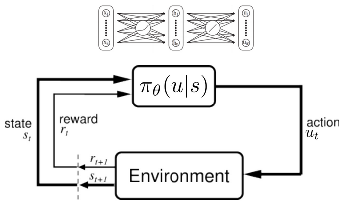

class: center, middle

# Evaluation of Deep Reinforcement Learning algorithms in Rich and Complex Environments for Locomotion Tasks

 
Author: Wilbert Santos Pumacay Huallpa
 
 
Advisor: José Eduardo Ochoa Luna

---

## OUTLINE

*   Motivation
*   Background
*   Related works
*   Proposal
*   Current Progress
*   Preliminary conclusions

---
class: center, middle, inverse
# Motivation

---

## Motivation

---

## Motivation

---
class: center, middle, inverse
# Background

---

## Background: Reinforcement Learning

*   Lorem ipsum dolor sit amet, consectetur adipiscing elit. Aliquam faucibus nisi 
    eget hendrerit auctor. Etiam vitae velit sit amet nibh luctus tincidunt.

--

*   Lorem ipsum dolor sit amet, consectetur adipiscing elit. Aliquam faucibus nisi 
    eget hendrerit auctor. Etiam vitae velit sit amet nibh luctus tincidunt.

---

## Background: Deep Reinforcement Learning

*   Lorem ipsum dolor sit amet, consectetur adipiscing elit. Aliquam faucibus nisi 
    eget hendrerit auctor. Etiam vitae velit sit amet nibh luctus tincidunt.

---

## Background: Solution methods

*   Lorem ipsum dolor sit amet, consectetur adipiscing elit. Aliquam faucibus nisi 
    eget hendrerit auctor. Etiam vitae velit sit amet nibh luctus tincidunt.

.footnote[.red[>] Image taken from SpinningUp in RL [course](https://spinningup.openai.com/en/latest/) by OpenAI]

---

## Background: Simulated environments

*   Lorem ipsum dolor sit amet, consectetur adipiscing elit. Aliquam faucibus nisi 
    eget hendrerit auctor. Etiam vitae velit sit amet nibh luctus tincidunt.

---

## Background: Locomotion environments

*   Lorem ipsum dolor sit amet, consectetur adipiscing elit. Aliquam faucibus nisi 
    eget hendrerit auctor. Etiam vitae velit sit amet nibh luctus tincidunt.

---

class: center, middle, inverse
# Related works

---

## SOTA DeepRL algorithms

*   A simple equation with KaTex: \\( E_\pi \lbrace G_t | s_t = s \rbrace \\)

---

## SOTA locomotion in complex terrain

*   Lorem ipsum dolor sit amet, consectetur adipiscing elit. Aliquam faucibus nisi 
    eget hendrerit auctor. Etiam vitae velit sit amet nibh luctus tincidunt.

---

## SOTA DeepRL benchmarks for locomotion

*   Lorem ipsum dolor sit amet, consectetur adipiscing elit. Aliquam faucibus nisi 
    eget hendrerit auctor. Etiam vitae velit sit amet nibh luctus tincidunt.

---

class: center, middle, inverse
# Proposal

---

## Proposal: Overview

---

## Proposal: Q: Why?. A: Measure of intelligence

---

## Proposal: Q: Why?. A: Curriculum learning

---

## Proposal: Are we reinventing the wheel?

---

## Proposal: Technical details (1)

---

class: center, middle, inverse
# Current Progress

---

## Current Progress: Framework (1)

---

## Current Progress: Framework (2)

---

## Current Progress: Framework (3)

---

## Current Progress: Framework (4)

---

class: center, middle, inverse
# Preliminary conclusions

---

## Preliminary Conclusions

---
class: center, middle, inverse
# References

---

## References

---

class: center, middle, inverse
# Thanks

