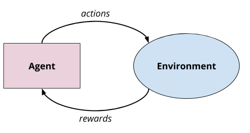
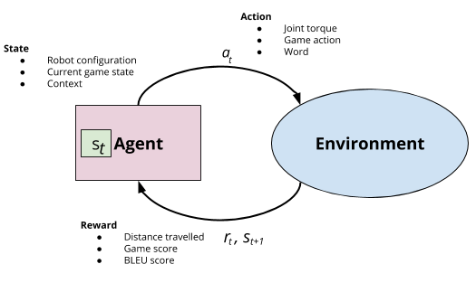
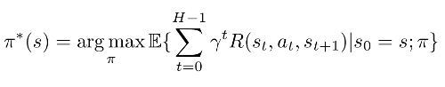
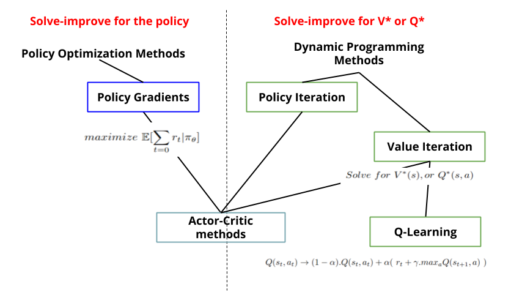
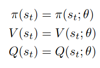
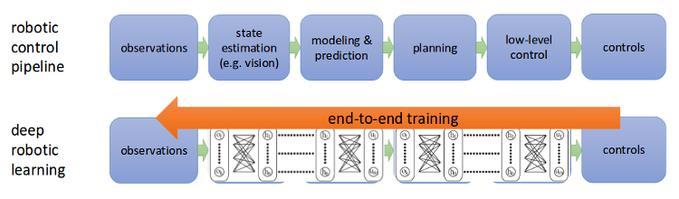
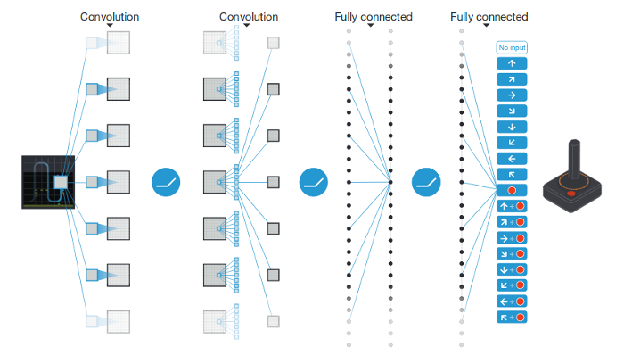
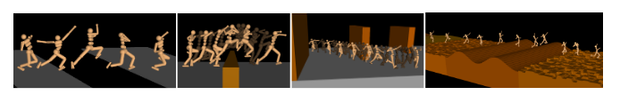
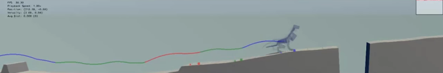
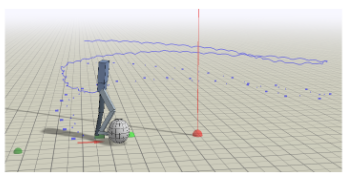

class: center, middle, inverse

# A preliminary study of the applications of Deep Reinforcement Learning
[Wilbert Pumacay]

---

<!-- logo -->
.logo[]

## TODAY

.slide_text_content[
*   Reinforcement Learning Background
*   Reinforcement Learning Solution Methods
*   Deep Reinforcement Learning
*   Related works
*   References
]

---
class: center, middle, inverse
# Reinforcement Learning Background

---

<!-- logo -->
.logo[]

## Reinforcement Learning Background

.slide_text_content[
Reinforcement learning is a learning paradigm in which an agent learns by interacting with an environment and optimizing the expected sum of rewards received from these interactions.
]

---
<!-- logo -->
.logo[]

## Markov decision processes ( MDP )

.slide_text_content[
    A Markov Decision Process is the basic framework for decision making when dealing with stochastic situations, and it is defined by these components :
    *  A set of states S = {s} ( state space )
    *  A set of actions A = {a} ( action space )
    *  A transition function T( s, a, s' ) = P( s' | s, a )
    *  A reward function R( s, a, s' )
]

---

<!-- logo -->
.logo[]

## Policies

.slide_text_content[
    The solution to a MDP is a policy, which is a 'function' that returns an action for each given state the agent encounters. The best solution is called optimal policy, which is the policy that maximizes the expected sum of rewards over a trajectory started at an initial state.
]

---

class: center, middle, inverse
# Reinforcement Learning Solution Methods

---

<!-- logo -->
.logo[]

## Methods

---

class: center, middle, inverse
# Deep Reinforcement Learning

---

<!-- logo -->
.logo[]

## Deep Reinforcement Learning

.slide_text_content[
    Use Deep Neural Networks to 'approximate' modules of a RL setting:
    *   Policies
    *   Value or Q-value functions
    *   Dynamics Models
]

---

<!-- logo -->
.logo[]

## Deep Reinforcement Learning

.slide_text_content[
    By using this approach we can train an agent end-to-end and get a full pipeline, which otherwise would have been hand-crafted.
]

.footnote[.red[*] Image taken from Berkeley's Deep RL course slides]

---

class: center, middle, inverse
# Related works

---

<!-- logo -->
.logo[]

## Deep Q-Networks

 Architecture of DQN, from paper [1]

---

<!-- logo -->
.logo[]

## Locomotion

 Humanoid running in simulated environment, from paper [2] 

 Quadruped running in simulated environment, from paper [4]

---

<!-- logo -->
.logo[]

## More locomotion

 Biped doing task in simulated environment, from paper [5]

 Virtual stuntman in simulated environment, from paper [6]

---

class: center, middle, inverse
# References

---

<!-- logo -->
.logo[]

## References

.slide_text_content[
*   [1] Volodymyr Mnih, et al. Human-level control through deep reinforcement learning. Nature - 2015.
*   [2] Emergence of Locomotion Behaviours in Rich Environments. ArXiv - 2017.
*   [3] Pieter Abbeel, John Schulman. Deep Reinforcement Learning through policy optimization. NIPS - 2016.
*   [4] Xue Bin Peng, Glen Berseth, Michiel van de Panne. Terrain-adaptive locomotion skills using deep reinforcement learning. SIGGRAPH - 2016.
*   [5] Xue Bin Peng, Glen Berseth, KangKang Yin, Michiel van de Panne. Deeploco: Dynamic locomotion skillsusing hierarchical deep reinforcement learning. SIGGRAPH - 2017.
*   [6] Xue Bin Peng, Pieter Abbeel, Sergey Levine, Michiel van de Panne. DeepMimic: Example-Guided Deep Reinforcement learning of Physics-Based Character Skills. Proc. SIGGRAPH - 2018:
]

---

class: center, middle, inverse
# Thanks