class: center, middle, inverse

# A quick overview of (Deep)Reinforcement Learning
 
[Wilbert Santos Pumacay Huallpa]

---

## OUTLINE

.slide_text_content[
*   The RL problem
*   Some nuts and bolts of RL
*   An overview of the solution methods
*   Value based methods
    *   Model-based methods using DP
    *   Model-free prediction using MC and TD
    *   Model-free control using MC, SARSA and Q-learning
*   Function Approximation
*   Policy based methods
    *   Vanilla Policy Gradients
    *   Improving PG
    *   Actor-Critic
*   An overview of DeepRL
    *   Why DeepRL?
    *   Case study: DQN
    *   Case study: PPO
]

---
class: center, middle, inverse
# The RL problem

---

## The RL problem

.slide_text_content[
*   RL is a learning approach in which an agent **learns by interaction** with the 
    environment.
]

---

## The RL problem

.slide_text_content[
*   RL is a learning approach in which an agent **learns by interaction** with the 
    environment. 
*   By each interaction the agent makes with the environment (by taking **actions**), 
    the agent ends up in a different state (because of the **environment dynamics**) 
    and receives a **reward** from the environment according to this transition.
]

---

## The RL problem

.slide_text_content[
*   RL is a learning approach in which an agent **learns by interaction** with the 
    environment. 
*   By each interaction the agent makes with the environment (by taking **actions**), 
    the agent ends up in a different state (because of the **environment dynamics**) 
    and receives a **reward** from the environment according to this transition.
*   The objective of the agent is then to get the most reward it can in all its
    interactions, so it tries to pick actions that would try to **maximize the total
    sum of rewards**.
]

---

## The RL problem

.slide_text_content[
*   RL is a learning approach in which an agent **learns by interaction** with the 
    environment. 
*   By each interaction the agent makes with the environment (by taking **actions**), 
    the agent ends up in a different state (because of the **environment dynamics**) 
    and receives a **reward** from the environment according to this transition.
*   The objective of the agent is then to get the most reward it can in all its
    interactions, so it tries to pick actions that would try to **maximize the total
    sum of rewards**.
]

---

## Example: locomotion

---

## Example: video games

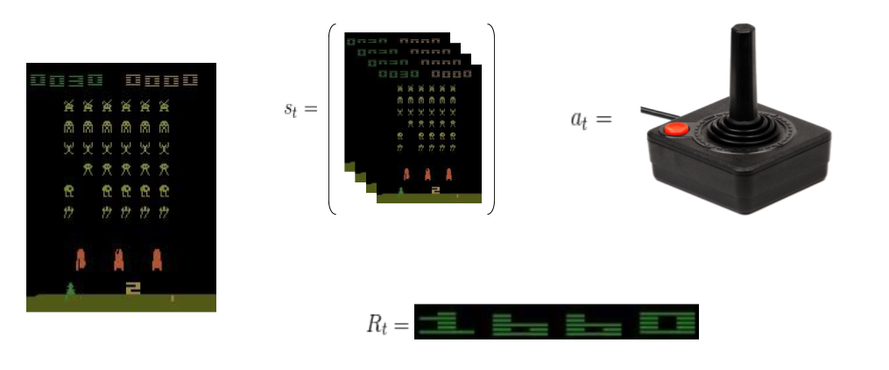

---

## RL background: MDPs

.slide_text_content[
*   To mathematically formalize the RL problem we make use of Markov Decision Processes (MDPs),
    which are a framework to model sequential decision making problems under uncertainty.
]

---

## RL background: MDPs

.slide_text_content[
*   To mathematically formalize the RL problem we make use of Markov Decision Processes (MDPs),
    which are a framework to model sequential decision making problems under uncertainty.
]

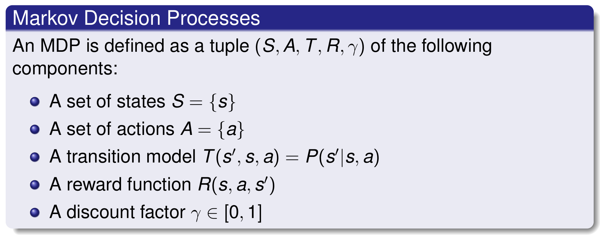

---

## RL background: Returns

.slide_text_content[
*   As mentioned earlier, the objective of the agent is to maximize the sum of rewards
    (discounted sum if using a discount factor) it gets from its interaction with
    the environment.
]

---

## RL background: Returns

.slide_text_content[
*   As mentioned earlier, the objective of the agent is to maximize the sum of rewards
    (discounted sum if using a discount factor) it gets from its interaction with
    the environment.
*   We define the total (discounted) sum of rewards from timestep _t_ onwards as the **Return** \\(G_{t}\\).
]

---

## RL background: Returns

.slide_text_content[
*   As mentioned earlier, the objective of the agent is to maximize the sum of rewards
    (discounted sum if using a discount factor) it gets from its interaction with
    the environment.
*   We define the total (discounted) sum of rewards from timestep _t_ onwards as the **Return** \\(G_{t}\\).
]

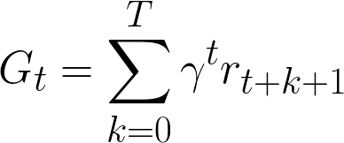

---

## RL background: Returns

.slide_text_content[
*   As mentioned earlier, the objective of the agent is to maximize the sum of rewards
    (discounted sum if using a discount factor) it gets from its interaction with
    the environment.
*   We define the total (discounted) sum of rewards from timestep _t_ onwards as the **Return** \\(G_{t}\\).
*   Because the return is a random variable, then the return will vary with each interaction
    with the environment. So instead we try to maximize the **expected sum of rewards**, or
    **Expected Return**.
]

---

## RL background: Returns

.slide_text_content[
*   As mentioned earlier, the objective of the agent is to maximize the sum of rewards
    (discounted sum if using a discount factor) it gets from its interaction with
    the environment.
*   We define the total (discounted) sum of rewards from timestep _t_ onwards as the **Return** \\(G_{t}\\).
*   Because the return is a random variable, then the return will vary with each interaction
    with the environment. So instead we try to maximize the **expected sum of rewards**, or
    **Expected Return**.
]

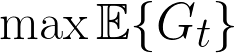

---

## RL background: Policies

.slide_text_content[
*   In order to get the most expected return possible, the agent has to pick its
    actions accordingly in each state it encounters.
*   This can be thought as a mapping between the state the agent is currently in
    and the action it should take. This mapping is called a **Policy** and is denoted
    by \\( \pi \\)
*   This relation can be either **deterministic** (pick a single action given the current state),
    or **stochastic** (pick a single action from a distribution given by the current state).
*   Thus we have two kind of policies: **deterministic policies** \\( a_t = \pi(s_t) \\), and
    **stochastic policies** \\( a_t \sim \pi( a | s_t ) \\).
]

---

## RL background: Policies

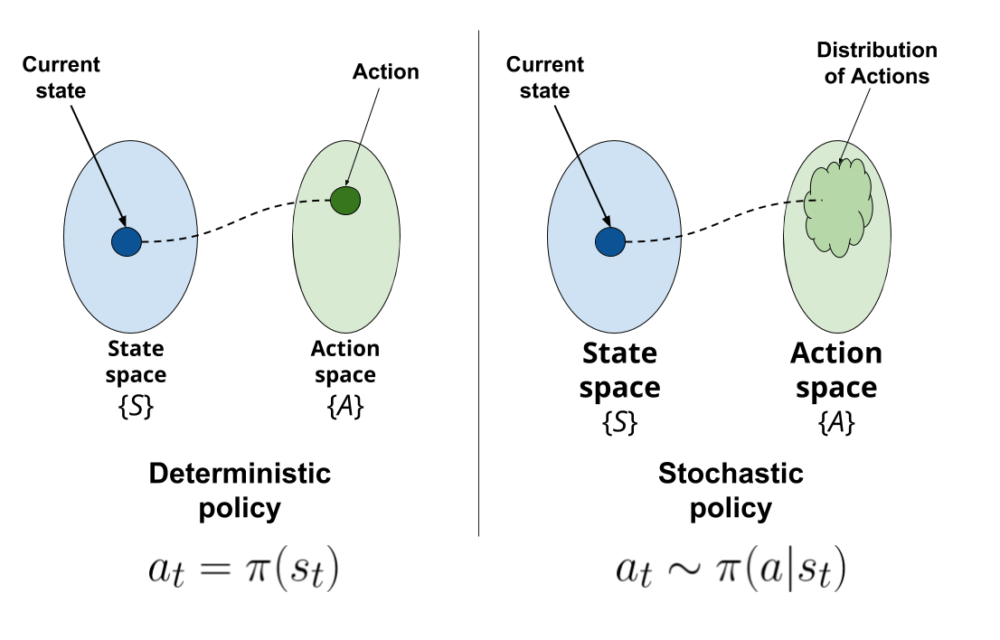

---

## RL background: Policies

.slide_text_content[
*   The solution to the RL problem is then to find a policy (either deterministic or
    stochastic) that for any state \\( s_t \\) maximizes the expected return it can get.
]

---

## RL background: Policies

.slide_text_content[
*   The solution to the RL problem is then to find a policy (either deterministic or
    stochastic) that for any state \\(s_t\\) maximizes the expected return it can get.
*   We call this policy the **Optimal Policy** \\( \pi^* \\), an it should satisfy 
    the following :
]

---

## RL background: Policies

.slide_text_content[
*   The solution to the RL problem is then to find a policy (either deterministic or
    stochastic) that for any state \\(s_t\\) maximizes the expected return it can get.
*   We call this policy the **Optimal Policy** \\( \pi^* \\), an it should satisfy 
    the following :
]

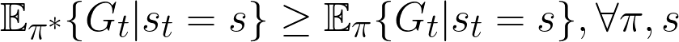

---

## RL background: State-value functions (V)

.slide_text_content[
*   As explained, the objective of the agent is to find a policy \\( \pi \\) that for any state \\( s \\)
    it picks actions that maximize the expected sum of rewards \\( \mathbb{E}_\pi \lbrace G_t | s_t = s \rbrace \\).
]

---

## RL background: State-value functions (V)

.slide_text_content[
*   As explained, the objective of the agent is to find a policy \\( \pi \\) that for any state \\( s \\)
    it picks actions that maximize the expected sum of rewards \\( \mathbb{E}_\pi \lbrace G_t | s_t = s \rbrace \\).
*   We can define the quantity we want to maximize as a function called **State-value** function \\( V_\pi (s) \\)
    that for any state \\( s \\) it will give the **expected return that we would get
    if we start at state \\(s_t = s\\) and follow the policy onwards**.
]

---

## RL background: State-value functions (V)

.slide_text_content[
*   As explained, the objective of the agent is to find a policy \\( \pi \\) that for any state \\( s \\)
    it picks actions that maximize the expected sum of rewards \\( \mathbb{E}_\pi \lbrace G_t | s_t = s \rbrace \\).
*   We can define the quantity we want to maximize as a function called **State-value** function \\( V_\pi (s) \\)
    that for any state \\( s \\) it will give the **expected return that we would get
    if we start at state \\(s_t = s\\) and follow the policy onwards**.
]

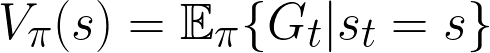

---

## RL background: State-value functions (V)

.slide_text_content[
*   This function serves as a kind of **intuition** about how well it is the current
    state \\( s \\) we are currently in.
]

---

## RL background: State-value functions (V)

.slide_text_content[
*   This function serves as a kind of **intuition** about how well it is the current
    state \\( s \\) we are currently in.
]

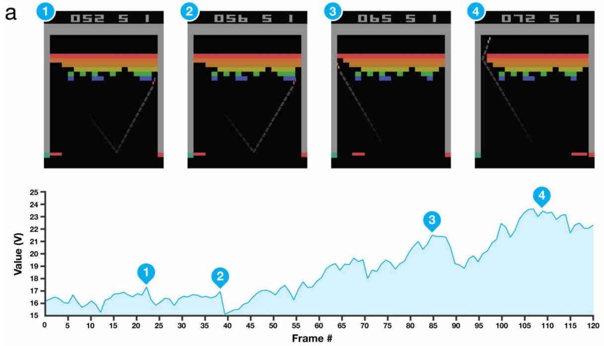

---

## RL background: Action-value functions (Q)

.slide_text_content[
*   Similarly, we can define a function that tells us how well it is an action \\( a_t \\) we
    take in our current state \\( s_t \\), and then follow the policy \\( \pi \\) onwards.
]

---

## RL background: Action-value functions (Q)

.slide_text_content[
*   Similarly, we can define a function that tells us how well it is an action \\( a_t \\) we
    take in our current state \\( s_t \\), and then follow the policy \\( \pi \\) onwards.
*   We call this function the **Action-value** function \\( Q_\pi (s,a) \\)
]

---

## RL background: Action-value functions (Q)

.slide_text_content[
*   Similarly, we can define a function that tells us how well it is an action \\( a_t \\) we
    take in our current state \\( s_t \\), and then follow the policy \\( \pi \\) onwards.
*   We call this function the **Action-value** function \\( Q_\pi (s,a) \\)
]

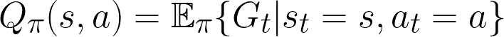

---

## RL background: Action-value functions (Q)

.slide_text_content[
*   This function also serves as a kind of **intuition**. It tells us how well
    a given decision \\( a_t \\) (any action, not necessarily from the policy \\( \pi \\) )
    is in the current situation given by the current state \\( s_t \\).
]

---

## RL background: Action-value functions (Q)

.slide_text_content[
*   This function also serves as a kind of **intuition**. It tells us how well
    a given decision \\( a_t \\) (any action, not necessarily from the policy \\( \pi \\) )
    is in the current situation given by the current state \\( s_t \\).
]

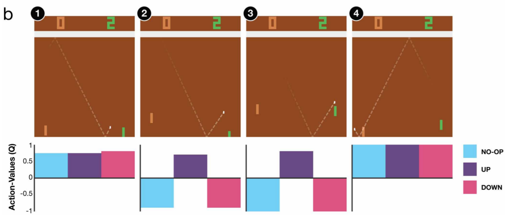

---

class: center, middle, inverse
# Some nuts and bolts of RL

---

<!-- POMDP SLIDE BEGIN --------------------------->
## Partially observable MDPs

.slide_text_content[
*   In general, the Markov property is not satisfied in most of the settings we work with,
    due to the fact that we cannot observe the full environment state.
]

---

## Partially observable MDPs

.slide_text_content[
*   In general, the Markov property is not satisfied in most of the settings we work with,
    due to the fact that we cannot observe the full environment state.
*   Instead, we usually just have an observation \\(o_t\\) that gives some information
    about the state of the environment.
]

---

## Partially observable MDPs

.slide_text_content[
*   In general, the Markov property is not satisfied in most of the settings we work with,
    due to the fact that we cannot observe the full environment state.
*   Instead, we usually just have an observation \\(o_t\\) that gives some information
    about the state of the environment.
]

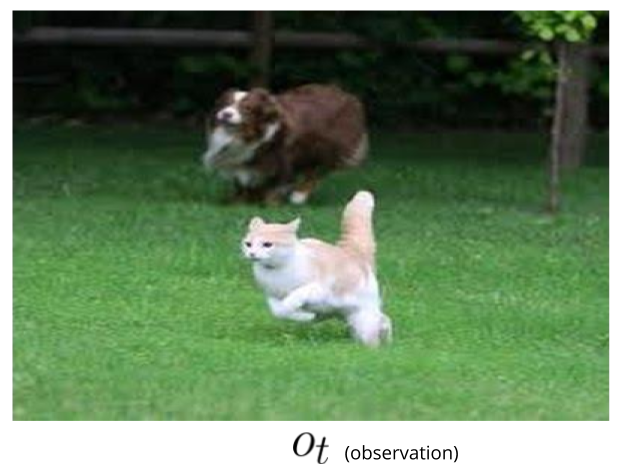

---

## Partially observable MDPs

.slide_text_content[
*   In general, the Markov property is not satisfied in most of the settings we work with,
    due to the fact that we cannot observe the full environment state.
*   Instead, we usually just have an observation \\(o_t\\) that gives some information
    about the state of the environment.
]

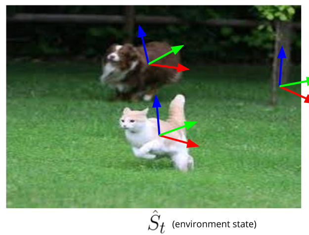

---

## Partially observable MDPs

.slide_text_content[
*   In general, the Markov property is not satisfied in most of the settings we work with,
    due to the fact that we cannot observe the full environment state.
*   Instead, we usually just have an observation \\(o_t\\) that gives some information
    about the state of the environment.
]

---

## Partially observable MDPs

.slide_text_content[
*   In general, the Markov property is not satisfied in most of the settings we work with,
    due to the fact that we cannot observe the full environment state.
*   Instead, we usually just have an observation \\(o_t\\) that gives some information
    about the state of the environment.
]

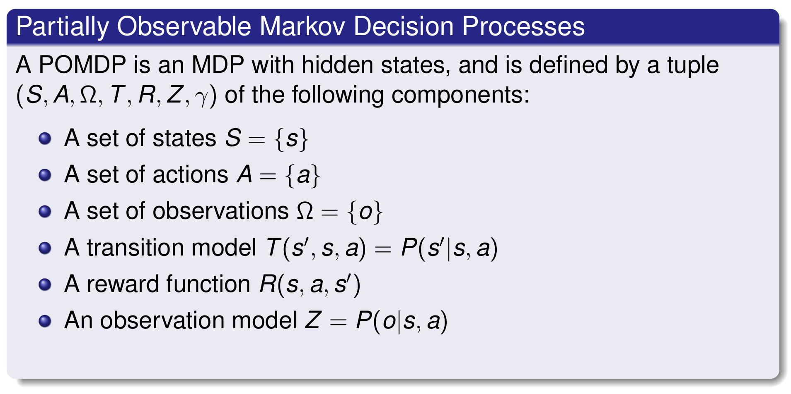

---

## Partially observable MDPs

.slide_text_content[
*   In general, the Markov property is not satisfied in most of the settings we work with,
    due to the fact that we cannot observe the full environment state.
*   Instead, we usually just have an observation \\(o_t\\) that gives some information
    about the state of the environment.
*   To avoid this, we can do state augmentation, to try to satisfy the underlying
    markov property of the environment (if any exists).
]

---

## Partially observable MDPs

.slide_text_content[
*   In general, the Markov property is not satisfied in most of the settings we work with,
    due to the fact that we cannot observe the full environment state.
*   Instead, we usually just have an observation \\(o_t\\) that gives some information
    about the state of the environment.
*   To avoid this, we can do state augmentation, to try to satisfy the underlying
    markov property of the environment (if any exists).
]

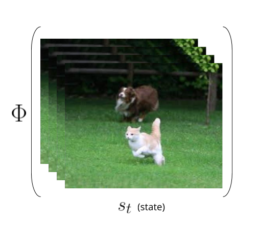

<!-- POMDP SLIDE END ----------------------------->

---

## Comparison to Supervised Learning

.slide_text_content[
*   In the context of Supervised Learning, we learn from a given dataset and
    optimize our model to _optimize a metric_/_minimize a loss_ for a certain task like
    classification.
*   For supervised learning tasks the dataset is given, and we make the assumption 
    that the data satisfies the **i.i.d** property (independent and identically distributed).
*   In RL we completely violate this assumption, due to the sequential nature of
    the tasks. 
*   Next states, rewards and observations are dependent of the previous state of the
    environment, and this in turn depended on the previous actions taken by the agent.
*   Basically, the experience (data) that the agent collects is dependent of previous
    actions (at least from the previous time step, if satisfying the Markov property).
]

---

class: center, middle, inverse
# An overview of the solution methods

---

## Solutions landscape

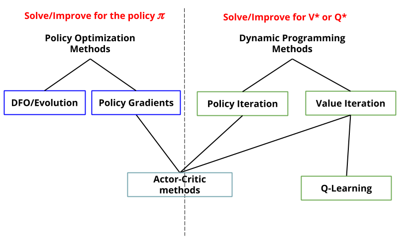

---

## A small disclaimer

.slide_text_content[
*   Most of the methods we will cover arise in the context of Finite MDPs, namely
    the state and action spaces are finite sets.
]

---

## A small disclaimer

.slide_text_content[
*   Most of the methods we will cover arise in the context of Finite MDPs, namely
    the state and action spaces are finite sets.
*   These methods are usually studied in the context of toy problems (small Finite MDPs)
    for which we can store the auxiliar functions defined earlier (\\( V(s), Q(s,a) \\))
    in tables.
]

---

## A small disclaimer

.slide_text_content[
*   Most of the methods we will cover arise in the context of Finite MDPs, namely
    the state and action spaces are finite sets.
*   These methods are usually studied in the context of toy problems (small Finite MDPs)
    for which we can store the auxiliar functions defined earlier (\\( V(s), Q(s,a) \\))
    in tables.
]

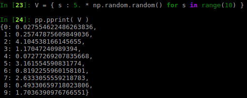

---

## A small disclaimer

.slide_text_content[
*   Most of the methods we will cover arise in the context of Finite MDPs, namely
    the state and action spaces are finite sets.
*   These methods are usually studied in the context of toy problems (small Finite MDPs)
    for which we can store the auxiliar functions defined earlier (\\( V(s), Q(s,a) \\))
    in tables.
]

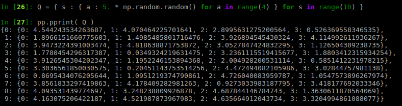

---

## A small disclaimer

.slide_text_content[
*   But despair not, as this are the basis for other algorithms that scale to
    larger MDPs (and even continous spaces). It's just that these methods build
    on top of various concepts from classic solution methods.
]

---

## A small disclaimer

.slide_text_content[
*   But despair not, as this are the basis for other algorithms that scale to
    larger MDPs (and even continous spaces). It's just that these methods build
    on top of various concepts from classic solution methods.
]

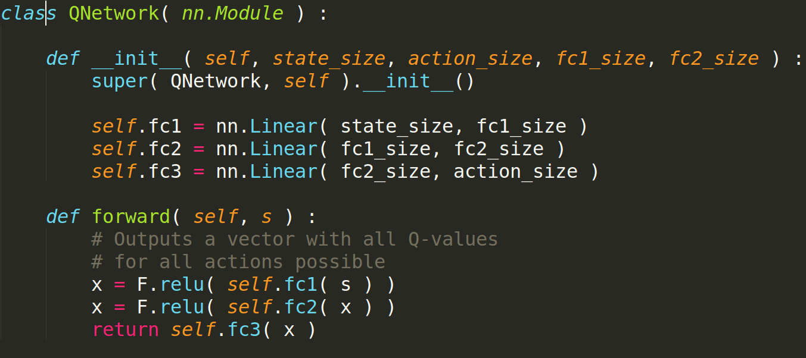

---

class: center, middle, inverse
# Value based methods

---

class: center, middle
# Model-based methods using Dynamic Programming

---

## Dynamic Programming (DP)

.slide_text_content[
*   DP is a method that we can use to solve certain problems by exploiting some
    properties of the problem :
    *   **Optimal substructure** : it satisfies the Principle of Optimality.
    *   **Overlapping subproblems** : can cache and reuse intermediate results to subproblems.
]

---

## Dynamic Programming (DP)

.slide_text_content[
*   DP is a method that we can use to solve certain problems by exploiting some
    properties of the problem :
    *   **Optimal substructure** : it satisfies the Principle of Optimality.
    *   **Overlapping subproblems** : can cache and reuse intermediate results to subproblems.
*   MDPs satisfy these properties :
    *   The objective (expected return) can be decomposed recursively
    *   We can reuse the previously calculated \\( V_\pi (s) \\)
]

---

## Dynamic Programming (DP)

.slide_text_content[
*   DP is a method that we can use to solve certain problems by exploiting some
    properties of the problem :
    *   **Optimal substructure** : it satisfies the Principle of Optimality.
    *   **Overlapping subproblems** : can cache and reuse intermediate results to subproblems.
*   MDPs satisfy these properties :
    *   The objective (expected return) can be decomposed recursively
    *   We can reuse the previously calculated \\( V_\pi (s) \\)
]

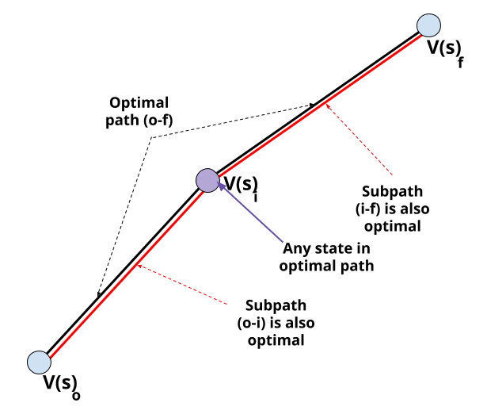

---

## Dynamic Programming (DP)

.slide_text_content[
*   DP is a method that we can use to solve certain problems by exploiting some
    properties of the problem :
    *   **Optimal substructure** : it satisfies the Principle of Optimality.
    *   **Overlapping subproblems** : can cache and reuse intermediate results to subproblems.
*   MDPs satisfy these properties :
    *   The objective (expected return) can be decomposed recursively
    *   We can reuse the previously calculated \\( V_\pi (s) \\)
*   We can use DP to solve for \\( V_\pi(s) \\), given that we have the transition 
    model (dynamics of the environment) \\( p(s',r|s,a) \\) and we store the value
    function somewhere (like in a Table for finite MDPs).
]

<!-- 
    V^{*}(s) = \max_{a} \sum_{a} \pi(a|s) \sum_{s',r} p( s',r|s,a )(r + \gamma V^{*}(s') ) 
-->

---

## DP: Bellman Equations

.slide_text_content[
*   Using the optimal substructure of our problem we can derive some equations
    that we must satisfy if the have found the \\( V_\pi(s) \\) we are looking for.
]

---

## DP: Bellman Equations

.slide_text_content[
*   Using the optimal substructure of our problem we can derive some equations
    that we must satisfy if the have found the \\( V_\pi(s) \\) we are looking for.
*   First, let's start by computing how well is a given policy \\( \pi \\). This
    is called **Policy Evaluation**, and we usually refer to this process as **Prediction**.
]

---

## DP: Bellman Equations

.slide_text_content[
*   Using the optimal substructure of our problem we can derive some equations
    that we must satisfy if the have found the \\( V_\pi(s) \\) we are looking for.
*   First, let's start by computing how well is a given policy \\( \pi \\). This
    is called **Policy Evaluation**, and we usually refer to this process as **Prediction**.
]

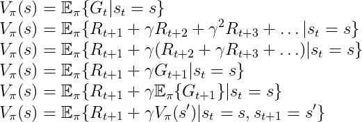

---

## DP: Bellman Equations

.slide_text_content[
*   Using the optimal substructure of our problem we can derive some equations
    that we must satisfy if the have found the \\( V_\pi(s) \\) we are looking for.
*   First, let's start by computing how well is a given policy \\( \pi \\). This
    is called **Policy Evaluation**, and we usually refer to this process as **Prediction**.
]

---

## DP: Bellman Equations

.slide_text_content[
*   Using the optimal substructure of our problem we can derive some equations
    that we must satisfy if the have found the \\( V_\pi(s) \\) we are looking for.
*   First, let's start by computing how well is a given policy \\( \pi \\). This
    is called **Policy Evaluation**, and we usually refer to this process as **Prediction**.
]

---

## DP: Bellman Equations

.slide_text_content[
*   Using the optimal substructure of our problem we can derive some equations
    that we must satisfy if the have found the \\( V_\pi(s) \\) we are looking for.
*   First, let's start by computing how well is a given policy \\( \pi \\). This
    is called **Policy Evaluation**, and we usually refer to this process as **Prediction**.
]

---

## DP: Bellman Equations

.slide_text_content[
*   Using the optimal substructure of our problem we can derive some equations
    that we must satisfy if the have found the \\( V_\pi(s) \\) we are looking for.
*   First, let's start by computing how well is a given policy \\( \pi \\). This
    is called **Policy Evaluation**, and we usually refer to this process as **Prediction**.
]

---

## DP: Bellman Equations

.slide_text_content[
*   Using the optimal substructure of our problem we can derive some equations
    that we must satisfy if the have found the \\( V_\pi(s) \\) we are looking for.
*   First, let's start by computing how well is a given policy \\( \pi \\). This
    is called **Policy Evaluation**, and we usually refer to this process as **Prediction**.
]

<!-- 

 \\
V_{\pi}(s) = \mathbb{E}_{\pi} \lbrace G_{t} | s_{t} = s \rbrace \\
V_{\pi}(s) = \mathbb{E}_{\pi} \lbrace R_{t+1} + \gamma R_{t+2} + \gamma^{2}R_{t+3} + \hdots | s_{t} = s \rbrace \\
V_{\pi}(s) = \mathbb{E}_{\pi} \lbrace R_{t+1} + \gamma (R_{t+2} + \gamma R_{t+3} + \hdots ) | s_{t} = s \rbrace \\
V_{\pi}(s) = \mathbb{E}_{\pi} \lbrace R_{t+1} + \gamma G_{t+1} | s_{t} = s \rbrace \\
V_{\pi}(s) = \mathbb{E}_{\pi} \lbrace R_{t+1} + \gamma \mathbb{E}_{\pi} \lbrace G_{t+1} \rbrace | s_{t} = s \rbrace \\
V_{\pi}(s) = \mathbb{E}_{\pi} \lbrace R_{t+1} + \gamma V_{\pi}(s') | s_{t} = s, s_{t+1} = s' \rbrace \\

V_{\pi}(s) = \sum_{a} \pi(a|s) \sum_{s',r} p(s',r|s,a) ( r + \gamma V_{\pi}(s') )

-->

---

## Bellman Expectation Equation for V

.slide_text_content[
*   We can expand the expectation using the distribution of states for one step
    into the future. If we do so, we end up with the **Bellman Expectation Equation**
]

---

## Bellman Expectation Equation for V

.slide_text_content[
*   We can expand the expectation using the distribution of states for one step
    into the future. If we do so, we end up with the **Bellman Expectation Equation**
]

---

## Bellman Expectation Equation for V

.slide_text_content[
*   We can expand the expectation using the distribution of states for one step
    into the future. If we do so, we end up with the **Bellman Expectation Equation**
*   This could be also represented using a diagram, called **Backup diagram**. So
    the backup diagram for the Bellman Expectation Equation looks like :
]

---

## Bellman Expectation Equation for V

.slide_text_content[
*   We can expand the expectation using the distribution of states for one step
    into the future. If we do so, we end up with the **Bellman Expectation Equation**
*   This could be also represented using a diagram, called **Backup diagram**. So
    the backup diagram for the Bellman Expectation Equation looks like :
]

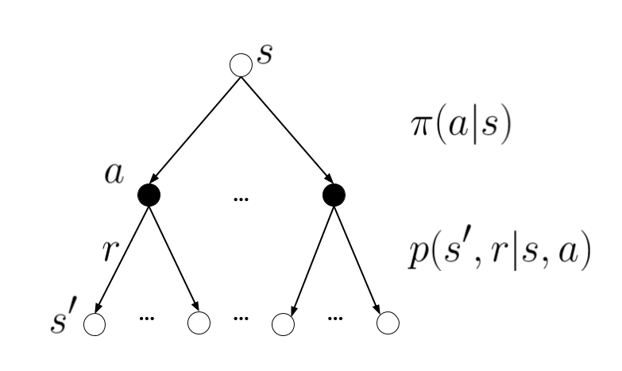
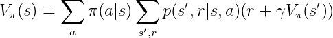

---

## A zoo of Bellman Equations

.slide_text_content[
*   It turns out that there are some other Bellman Equations.
]

---

## A zoo of Bellman Equations

.slide_text_content[
*   It turns out that there are some other Bellman Equations.
*   We could use \\( Q(s,a) \\) instead of \\( V(s) \\).
]

---

## A zoo of Bellman Equations

.slide_text_content[
*   It turns out that there are some other Bellman Equations.
*   We could use \\( Q(s,a) \\) instead of \\( V(s) \\).
*   This would give us a Bellman Expectation Equation for \\( Q_\pi \\)
]

---

## A zoo of Bellman Equations

.slide_text_content[
*   It turns out that there are some other Bellman Equations.
*   We could use \\( Q(s,a) \\) instead of \\( V(s) \\).
*   This would give us a Bellman Expectation Equation for \\( Q_\pi \\)
]

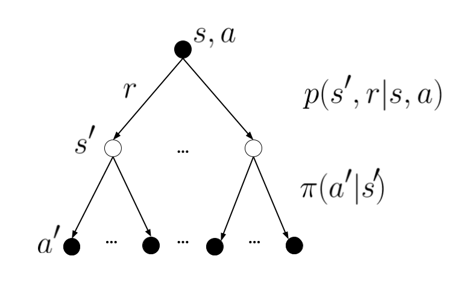
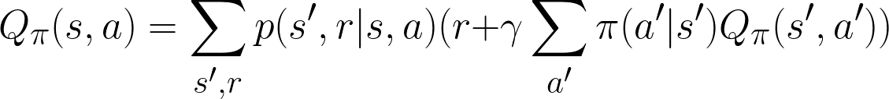

---

## A zoo of Bellman Equations

.slide_text_content[
*   We could also try to solve for the optimal solution instead of evaluating
    a given policy.
]

---

## A zoo of Bellman Equations

.slide_text_content[
*   We could also try to solve for the optimal solution instead of evaluating
    a given policy.
*   This would give us an equation called **Bellman Optimality Equation**.
]

---

## A zoo of Bellman Equations

.slide_text_content[
*   We could also try to solve for the optimal solution instead of evaluating
    a given policy.
*   This would give us an equation called **Bellman Optimality Equation**.
*   For the \\( V \\) value function we would get:
]

---

## A zoo of Bellman Equations

.slide_text_content[
*   We could also try to solve for the optimal solution instead of evaluating
    a given policy.
*   This would give us an equation called **Bellman Optimality Equation**.
*   For the \\( V \\) value function we would get:
]

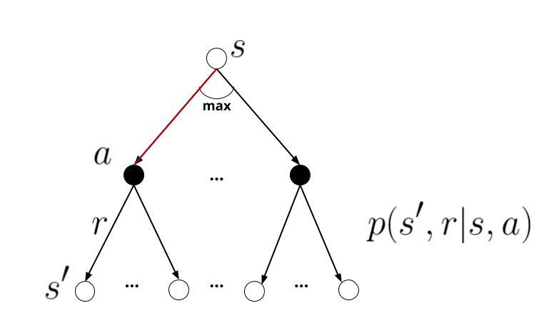
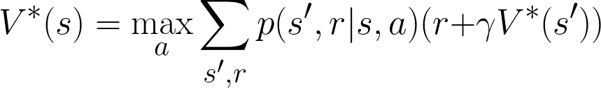

---

## A zoo of Bellman Equations

.slide_text_content[
*   We could also try to solve for the optimal solution instead of evaluating
    a given policy.
*   This would give us an equation called **Bellman Optimality Equation**.
*   For the \\( Q \\) value function we would get:
]

<!--

Q_{\pi}(s,a) = \sum_{s',r} p(s',r|s,a)( r + \gamma \sum_{a'} \pi(a'|s') Q_{\pi}(s',a') )
V^{*}(s) = \max_{a} \sum_{s',r} p(s',r|s,a) ( r + \gamma V^{*}(s') )

-->

---

## A zoo of Bellman Equations

.slide_text_content[
*   We could also try to solve for the optimal solution instead of evaluating
    a given policy.
*   This would give us an equation called **Bellman Optimality Equation**.
*   For the \\( Q \\) value function we would get:
]

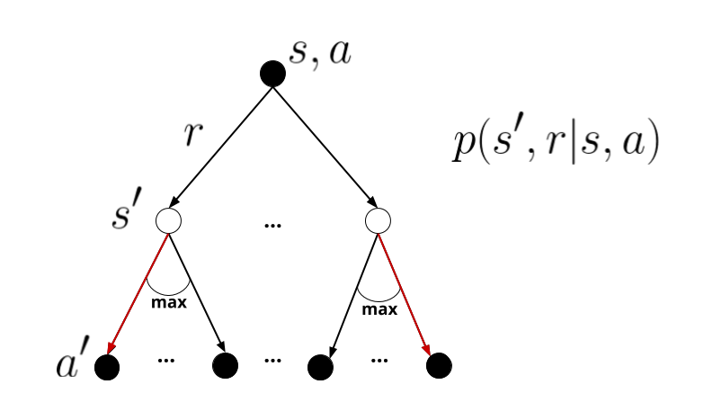
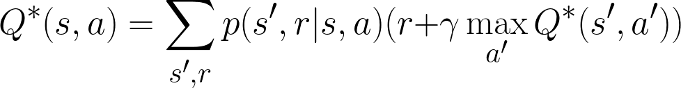

---

class: center, middle, inverse
# Model-free prediction using MC and TD

---

class: center, middle, inverse
# Model-free control using MC, SARSA and Q-learning

---

class: center, middle, inverse
# Function Approximation

---

class: center, middle, inverse
# Policy based methods

---

## Vanilla Policy Gradients

---

## Improving PG

---

## Actor-Critic

---

class: center, middle, inverse
# An overview of DeepRL

---

## Why DeepRL?

---

## Case study: DQN

---

## Case study: PPO

---