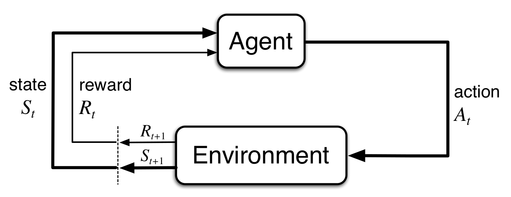
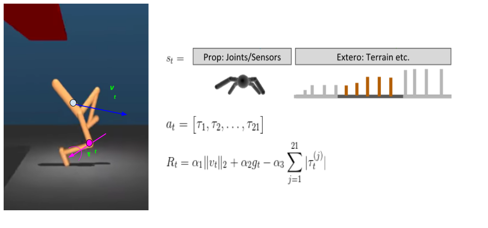

class: center, middle, inverse

# A quick overview of (Deep)Reinforcement Learning
 
[Wilbert Santos Pumacay Huallpa]

---

## Just an announcement

.slide_text_content[
*   link: https://khipu.ai
]

---

## OUTLINE

.slide_text_content[
*   The RL problem
*   Some nuts and bolts of RL
*   An overview of the solution methods
*   Value based methods
    *   Model-based methods using DP
    *   Model-free prediction using MC and TD
    *   Model-free control using MC, SARSA and Q-learning
*   Function Approximation
*   Policy based methods
    *   Vanilla Policy Gradients
    *   Improving PG
*   An overview of DeepRL
    *   Why DeepRL?
    *   Case study: DQN
    *   Case study: PPO
]

 
[Slides: https://wpumacay.github.io/slides/tutorials/drl_in_a_hurry]

---
class: center, middle, inverse
# The RL problem

---

## The RL problem

.slide_text_content[
*   RL is a learning approach in which an agent **learns by interaction** with the 
    environment.
]

---

## The RL problem

.slide_text_content[
*   RL is a learning approach in which an agent **learns by interaction** with the 
    environment. 
*   By each interaction the agent makes with the environment (by taking **actions**), 
    the agent ends up in a different state (because of the **environment dynamics**) 
    and receives a **reward** from the environment according to this transition.
]

---

## The RL problem

.slide_text_content[
*   RL is a learning approach in which an agent **learns by interaction** with the 
    environment. 
*   By each interaction the agent makes with the environment (by taking **actions**), 
    the agent ends up in a different state (because of the **environment dynamics**) 
    and receives a **reward** from the environment according to this transition.
*   The objective of the agent is then to get the most reward it can in all its
    interactions, so it tries to pick actions that would try to **maximize the total
    sum of rewards**.
]

---

## The RL problem

.slide_text_content[
*   RL is a learning approach in which an agent **learns by interaction** with the 
    environment. 
*   By each interaction the agent makes with the environment (by taking **actions**), 
    the agent ends up in a different state (because of the **environment dynamics**) 
    and receives a **reward** from the environment according to this transition.
*   The objective of the agent is then to get the most reward it can in all its
    interactions, so it tries to pick actions that would try to **maximize the total
    sum of rewards**.
]

---

## Example: locomotion

---

## Example: video games

---

## RL background: MDPs

.slide_text_content[
*   To mathematically formalize the RL problem we make use of Markov Decision Processes (MDPs),
    which are a framework to model sequential decision making problems under uncertainty.
]

---

## RL background: MDPs

.slide_text_content[
*   To mathematically formalize the RL problem we make use of Markov Decision Processes (MDPs),
    which are a framework to model sequential decision making problems under uncertainty.
]

---

## RL background: Returns

.slide_text_content[
*   As mentioned earlier, the objective of the agent is to maximize the sum of rewards
    (discounted sum if using a discount factor) it gets from its interaction with
    the environment.
]

---

## RL background: Returns

.slide_text_content[
*   As mentioned earlier, the objective of the agent is to maximize the sum of rewards
    (discounted sum if using a discount factor) it gets from its interaction with
    the environment.
*   We define the total (discounted) sum of rewards from timestep _t_ onwards as the **Return** \\(G_{t}\\).
]

---

## RL background: Returns

.slide_text_content[
*   As mentioned earlier, the objective of the agent is to maximize the sum of rewards
    (discounted sum if using a discount factor) it gets from its interaction with
    the environment.
*   We define the total (discounted) sum of rewards from timestep _t_ onwards as the **Return** \\(G_{t}\\).
]

---

## RL background: Returns

.slide_text_content[
*   As mentioned earlier, the objective of the agent is to maximize the sum of rewards
    (discounted sum if using a discount factor) it gets from its interaction with
    the environment.
*   We define the total (discounted) sum of rewards from timestep _t_ onwards as the **Return** \\(G_{t}\\).
*   Because the return is a random variable, then the return will vary with each interaction
    with the environment. So instead we try to maximize the **expected sum of rewards**, or
    **Expected Return**.
]

---

## RL background: Returns

.slide_text_content[
*   As mentioned earlier, the objective of the agent is to maximize the sum of rewards
    (discounted sum if using a discount factor) it gets from its interaction with
    the environment.
*   We define the total (discounted) sum of rewards from timestep _t_ onwards as the **Return** \\(G_{t}\\).
*   Because the return is a random variable, then the return will vary with each interaction
    with the environment. So instead we try to maximize the **expected sum of rewards**, or
    **Expected Return**.
]

---

## RL background: Policies

.slide_text_content[
*   In order to get the most expected return possible, the agent has to pick its
    actions accordingly in each state it encounters.
*   This can be thought as a mapping between the state the agent is currently in
    and the action it should take. This mapping is called a **Policy** and is denoted
    by \\( \pi \\)
*   This relation can be either **deterministic** (pick a single action given the current state),
    or **stochastic** (pick a single action from a distribution given by the current state).
*   Thus we have two kind of policies: **deterministic policies** \\( a_t = \pi(s_t) \\), and
    **stochastic policies** \\( a_t \sim \pi( a | s_t ) \\).
]

---

## RL background: Policies

---

## RL background: Policies

.slide_text_content[
*   The solution to the RL problem is then to find a policy (either deterministic or
    stochastic) that for any state \\( s_t \\) maximizes the expected return it can get.
]

---

## RL background: Policies

.slide_text_content[
*   The solution to the RL problem is then to find a policy (either deterministic or
    stochastic) that for any state \\(s_t\\) maximizes the expected return it can get.
*   We call this policy the **Optimal Policy** \\( \pi^* \\), an it should satisfy 
    the following :
]

---

## RL background: Policies

.slide_text_content[
*   The solution to the RL problem is then to find a policy (either deterministic or
    stochastic) that for any state \\(s_t\\) maximizes the expected return it can get.
*   We call this policy the **Optimal Policy** \\( \pi^* \\), an it should satisfy 
    the following :
]

---

## RL background: State-value functions (V)

.slide_text_content[
*   As explained, the objective of the agent is to find a policy \\( \pi \\) that for any state \\( s \\)
    it picks actions that maximize the expected sum of rewards \\( \mathbb{E}_\pi \lbrace G_t | s_t = s \rbrace \\).
]

---

## RL background: State-value functions (V)

.slide_text_content[
*   As explained, the objective of the agent is to find a policy \\( \pi \\) that for any state \\( s \\)
    it picks actions that maximize the expected sum of rewards \\( \mathbb{E}_\pi \lbrace G_t | s_t = s \rbrace \\).
*   We can define the quantity we want to maximize as a function called **State-value** function \\( V_\pi (s) \\)
    that for any state \\( s \\) it will give the **expected return that we would get
    if we start at state \\(s_t = s\\) and follow the policy onwards**.
]

---

## RL background: State-value functions (V)

.slide_text_content[
*   As explained, the objective of the agent is to find a policy \\( \pi \\) that for any state \\( s \\)
    it picks actions that maximize the expected sum of rewards \\( \mathbb{E}_\pi \lbrace G_t | s_t = s \rbrace \\).
*   We can define the quantity we want to maximize as a function called **State-value** function \\( V_\pi (s) \\)
    that for any state \\( s \\) it will give the **expected return that we would get
    if we start at state \\(s_t = s\\) and follow the policy onwards**.
]

---

## RL background: State-value functions (V)

.slide_text_content[
*   This function serves as a kind of **intuition** about how well it is the current
    state \\( s \\) we are currently in.
]

---

## RL background: State-value functions (V)

.slide_text_content[
*   This function serves as a kind of **intuition** about how well it is the current
    state \\( s \\) we are currently in.
]

---

## RL background: Action-value functions (Q)

.slide_text_content[
*   Similarly, we can define a function that tells us how well it is an action \\( a_t \\) we
    take in our current state \\( s_t \\), and then follow the policy \\( \pi \\) onwards.
]

---

## RL background: Action-value functions (Q)

.slide_text_content[
*   Similarly, we can define a function that tells us how well it is an action \\( a_t \\) we
    take in our current state \\( s_t \\), and then follow the policy \\( \pi \\) onwards.
*   We call this function the **Action-value** function \\( Q_\pi (s,a) \\)
]

---

## RL background: Action-value functions (Q)

.slide_text_content[
*   Similarly, we can define a function that tells us how well it is an action \\( a_t \\) we
    take in our current state \\( s_t \\), and then follow the policy \\( \pi \\) onwards.
*   We call this function the **Action-value** function \\( Q_\pi (s,a) \\)
]

---

## RL background: Action-value functions (Q)

.slide_text_content[
*   This function also serves as a kind of **intuition**. It tells us how well
    a given decision \\( a_t \\) (any action, not necessarily from the policy \\( \pi \\) )
    is in the current situation given by the current state \\( s_t \\).
]

---

## RL background: Action-value functions (Q)

.slide_text_content[
*   This function also serves as a kind of **intuition**. It tells us how well
    a given decision \\( a_t \\) (any action, not necessarily from the policy \\( \pi \\) )
    is in the current situation given by the current state \\( s_t \\).
]

---

class: center, middle, inverse
# Some nuts and bolts of RL

---

<!-- POMDP SLIDE BEGIN --------------------------->
## Partially observable MDPs

.slide_text_content[
*   In general, the Markov property is not satisfied in most of the settings we work with,
    due to the fact that we cannot observe the full environment state.
]

---

## Partially observable MDPs

.slide_text_content[
*   In general, the Markov property is not satisfied in most of the settings we work with,
    due to the fact that we cannot observe the full environment state.
*   Instead, we usually just have an observation \\(o_t\\) that gives some information
    about the state of the environment.
]

---

## Partially observable MDPs

.slide_text_content[
*   In general, the Markov property is not satisfied in most of the settings we work with,
    due to the fact that we cannot observe the full environment state.
*   Instead, we usually just have an observation \\(o_t\\) that gives some information
    about the state of the environment.
]

---

## Partially observable MDPs

.slide_text_content[
*   In general, the Markov property is not satisfied in most of the settings we work with,
    due to the fact that we cannot observe the full environment state.
*   Instead, we usually just have an observation \\(o_t\\) that gives some information
    about the state of the environment.
]

---

## Partially observable MDPs

.slide_text_content[
*   In general, the Markov property is not satisfied in most of the settings we work with,
    due to the fact that we cannot observe the full environment state.
*   Instead, we usually just have an observation \\(o_t\\) that gives some information
    about the state of the environment.
]

---

## Partially observable MDPs

.slide_text_content[
*   In general, the Markov property is not satisfied in most of the settings we work with,
    due to the fact that we cannot observe the full environment state.
*   Instead, we usually just have an observation \\(o_t\\) that gives some information
    about the state of the environment.
]

---

## Partially observable MDPs

.slide_text_content[
*   In general, the Markov property is not satisfied in most of the settings we work with,
    due to the fact that we cannot observe the full environment state.
*   Instead, we usually just have an observation \\(o_t\\) that gives some information
    about the state of the environment.
*   To avoid this, we can do state augmentation, to try to satisfy the underlying
    markov property of the environment (if any exists).
]

---

## Partially observable MDPs

.slide_text_content[
*   In general, the Markov property is not satisfied in most of the settings we work with,
    due to the fact that we cannot observe the full environment state.
*   Instead, we usually just have an observation \\(o_t\\) that gives some information
    about the state of the environment.
*   To avoid this, we can do state augmentation, to try to satisfy the underlying
    markov property of the environment (if any exists).
]

<!-- POMDP SLIDE END ----------------------------->

---

## Comparison to Supervised Learning

.slide_text_content[
*   In the context of Supervised Learning, we learn from a given dataset and
    optimize our model to _optimize a metric_/_minimize a loss_ for a certain task like
    classification.
*   For supervised learning tasks the dataset is given, and we make the assumption 
    that the data satisfies the **i.i.d** property (independent and identically distributed).
*   In RL we completely violate this assumption, due to the sequential nature of
    the tasks. 
*   Next states, rewards and observations are dependent of the previous state of the
    environment, and this in turn depended on the previous actions taken by the agent.
*   Basically, the experience (data) that the agent collects is dependent of previous
    actions (at least from the previous time step, if satisfying the Markov property).
]

---

class: center, middle, inverse
# An overview of the solution methods

---

## Solutions landscape

---

## A small disclaimer

.slide_text_content[
*   Most of the methods we will cover arise in the context of Finite MDPs, namely
    the state and action spaces are finite sets.
]

---

## A small disclaimer

.slide_text_content[
*   Most of the methods we will cover arise in the context of Finite MDPs, namely
    the state and action spaces are finite sets.
*   These methods are usually studied in the context of toy problems (small Finite MDPs)
    for which we can store the auxiliar functions defined earlier (\\( V(s), Q(s,a) \\))
    in tables.
]

---

## A small disclaimer

.slide_text_content[
*   Most of the methods we will cover arise in the context of Finite MDPs, namely
    the state and action spaces are finite sets.
*   These methods are usually studied in the context of toy problems (small Finite MDPs)
    for which we can store the auxiliar functions defined earlier (\\( V(s), Q(s,a) \\))
    in tables.
]

---

## A small disclaimer

.slide_text_content[
*   Most of the methods we will cover arise in the context of Finite MDPs, namely
    the state and action spaces are finite sets.
*   These methods are usually studied in the context of toy problems (small Finite MDPs)
    for which we can store the auxiliar functions defined earlier (\\( V(s), Q(s,a) \\))
    in tables.
]

---

## A small disclaimer

.slide_text_content[
*   But despair not, as this are the basis for other algorithms that scale to
    larger MDPs (and even continous spaces). It's just that these methods build
    on top of various concepts from classic solution methods.
]

---

## A small disclaimer

.slide_text_content[
*   But despair not, as this are the basis for other algorithms that scale to
    larger MDPs (and even continous spaces). It's just that these methods build
    on top of various concepts from classic solution methods.
]

---

class: center, middle, inverse
# Value based methods

---

class: center, middle
# Model-based methods using Dynamic Programming

---

## Dynamic Programming (DP)

.slide_text_content[
*   DP is a method that we can use to solve certain problems by exploiting some
    properties of the problem :
    *   **Optimal substructure** : it satisfies the Principle of Optimality.
    *   **Overlapping subproblems** : can cache and reuse intermediate results to subproblems.
]

---

## Dynamic Programming (DP)

.slide_text_content[
*   DP is a method that we can use to solve certain problems by exploiting some
    properties of the problem :
    *   **Optimal substructure** : it satisfies the Principle of Optimality.
    *   **Overlapping subproblems** : can cache and reuse intermediate results to subproblems.
*   MDPs satisfy these properties :
    *   The objective (expected return) can be decomposed recursively
    *   We can reuse the previously calculated \\( V_\pi (s) \\)
]

---

## Dynamic Programming (DP)

.slide_text_content[
*   DP is a method that we can use to solve certain problems by exploiting some
    properties of the problem :
    *   **Optimal substructure** : it satisfies the Principle of Optimality.
    *   **Overlapping subproblems** : can cache and reuse intermediate results to subproblems.
*   MDPs satisfy these properties :
    *   The objective (expected return) can be decomposed recursively
    *   We can reuse the previously calculated \\( V_\pi (s) \\)
]

---

## Dynamic Programming (DP)

.slide_text_content[
*   DP is a method that we can use to solve certain problems by exploiting some
    properties of the problem :
    *   **Optimal substructure** : it satisfies the Principle of Optimality.
    *   **Overlapping subproblems** : can cache and reuse intermediate results to subproblems.
*   MDPs satisfy these properties :
    *   The objective (expected return) can be decomposed recursively
    *   We can reuse the previously calculated \\( V_\pi (s) \\)
*   We can use DP to solve for \\( V_\pi(s) \\), given that we have the transition 
    model (dynamics of the environment) \\( p(s',r|s,a) \\) and we store the value
    function somewhere (like in a Table for finite MDPs).
]

<!-- 
    V^{*}(s) = \max_{a} \sum_{a} \pi(a|s) \sum_{s',r} p( s',r|s,a )(r + \gamma V^{*}(s') ) 
-->

---

## DP: Bellman Equations

.slide_text_content[
*   Using the optimal substructure of our problem we can derive some equations
    that we must satisfy if the have found the \\( V_\pi(s) \\) we are looking for.
]

---

## DP: Bellman Equations

.slide_text_content[
*   Using the optimal substructure of our problem we can derive some equations
    that we must satisfy if the have found the \\( V_\pi(s) \\) we are looking for.
*   First, let's start by computing how well is a given policy \\( \pi \\). This
    is called **Policy Evaluation**, and we usually refer to this process as **Prediction**.
]

---

## DP: Bellman Equations

.slide_text_content[
*   Using the optimal substructure of our problem we can derive some equations
    that we must satisfy if the have found the \\( V_\pi(s) \\) we are looking for.
*   First, let's start by computing how well is a given policy \\( \pi \\). This
    is called **Policy Evaluation**, and we usually refer to this process as **Prediction**.
]

---

## DP: Bellman Equations

.slide_text_content[
*   Using the optimal substructure of our problem we can derive some equations
    that we must satisfy if the have found the \\( V_\pi(s) \\) we are looking for.
*   First, let's start by computing how well is a given policy \\( \pi \\). This
    is called **Policy Evaluation**, and we usually refer to this process as **Prediction**.
]

---

## DP: Bellman Equations

.slide_text_content[
*   Using the optimal substructure of our problem we can derive some equations
    that we must satisfy if the have found the \\( V_\pi(s) \\) we are looking for.
*   First, let's start by computing how well is a given policy \\( \pi \\). This
    is called **Policy Evaluation**, and we usually refer to this process as **Prediction**.
]

---

## DP: Bellman Equations

.slide_text_content[
*   Using the optimal substructure of our problem we can derive some equations
    that we must satisfy if the have found the \\( V_\pi(s) \\) we are looking for.
*   First, let's start by computing how well is a given policy \\( \pi \\). This
    is called **Policy Evaluation**, and we usually refer to this process as **Prediction**.
]

---

## DP: Bellman Equations

.slide_text_content[
*   Using the optimal substructure of our problem we can derive some equations
    that we must satisfy if the have found the \\( V_\pi(s) \\) we are looking for.
*   First, let's start by computing how well is a given policy \\( \pi \\). This
    is called **Policy Evaluation**, and we usually refer to this process as **Prediction**.
]

---

## DP: Bellman Equations

.slide_text_content[
*   Using the optimal substructure of our problem we can derive some equations
    that we must satisfy if the have found the \\( V_\pi(s) \\) we are looking for.
*   First, let's start by computing how well is a given policy \\( \pi \\). This
    is called **Policy Evaluation**, and we usually refer to this process as **Prediction**.
]

<!-- 

 \\
V_{\pi}(s) = \mathbb{E}_{\pi} \lbrace G_{t} | s_{t} = s \rbrace \\
V_{\pi}(s) = \mathbb{E}_{\pi} \lbrace R_{t+1} + \gamma R_{t+2} + \gamma^{2}R_{t+3} + \hdots | s_{t} = s \rbrace \\
V_{\pi}(s) = \mathbb{E}_{\pi} \lbrace R_{t+1} + \gamma (R_{t+2} + \gamma R_{t+3} + \hdots ) | s_{t} = s \rbrace \\
V_{\pi}(s) = \mathbb{E}_{\pi} \lbrace R_{t+1} + \gamma G_{t+1} | s_{t} = s \rbrace \\
V_{\pi}(s) = \mathbb{E}_{\pi} \lbrace R_{t+1} + \gamma \mathbb{E}_{\pi} \lbrace G_{t+1} \rbrace | s_{t} = s \rbrace \\
V_{\pi}(s) = \mathbb{E}_{\pi} \lbrace R_{t+1} + \gamma V_{\pi}(s') | s_{t} = s, s_{t+1} = s' \rbrace \\

V_{\pi}(s) = \sum_{a} \pi(a|s) \sum_{s',r} p(s',r|s,a) ( r + \gamma V_{\pi}(s') )

-->

---

## Bellman Expectation Equation for V

.slide_text_content[
*   We can expand the expectation using the distribution of states for one step
    into the future. If we do so, we end up with the **Bellman Expectation Equation**
]

---

## Bellman Expectation Equation for V

.slide_text_content[
*   We can expand the expectation using the distribution of states for one step
    into the future. If we do so, we end up with the **Bellman Expectation Equation**
]

---

## Bellman Expectation Equation for V

.slide_text_content[
*   We can expand the expectation using the distribution of states for one step
    into the future. If we do so, we end up with the **Bellman Expectation Equation**
*   This could be also represented using a diagram, called **Backup diagram**. So
    the backup diagram for the Bellman Expectation Equation looks like :
]

---

## Bellman Expectation Equation for V

.slide_text_content[
*   We can expand the expectation using the distribution of states for one step
    into the future. If we do so, we end up with the **Bellman Expectation Equation**
*   This could be also represented using a diagram, called **Backup diagram**. So
    the backup diagram for the Bellman Expectation Equation looks like :
]

---

## A zoo of Bellman Equations

.slide_text_content[
*   It turns out that there are some other Bellman Equations.
]

---

## A zoo of Bellman Equations

.slide_text_content[
*   It turns out that there are some other Bellman Equations.
*   We could use \\( Q(s,a) \\) instead of \\( V(s) \\).
]

---

## A zoo of Bellman Equations

.slide_text_content[
*   It turns out that there are some other Bellman Equations.
*   We could use \\( Q(s,a) \\) instead of \\( V(s) \\).
*   This would give us a Bellman Expectation Equation for \\( Q_\pi \\)
]

---

## A zoo of Bellman Equations

.slide_text_content[
*   It turns out that there are some other Bellman Equations.
*   We could use \\( Q(s,a) \\) instead of \\( V(s) \\).
*   This would give us a Bellman Expectation Equation for \\( Q_\pi \\)
]

---

## A zoo of Bellman Equations

.slide_text_content[
*   We could also try to solve for the optimal solution instead of evaluating
    a given policy.
]

---

## A zoo of Bellman Equations

.slide_text_content[
*   We could also try to solve for the optimal solution instead of evaluating
    a given policy.
*   This would give us an equation called **Bellman Optimality Equation**.
]

---

## A zoo of Bellman Equations

.slide_text_content[
*   We could also try to solve for the optimal solution instead of evaluating
    a given policy.
*   This would give us an equation called **Bellman Optimality Equation**.
*   For the \\( V \\) value function we would get:
]

---

## A zoo of Bellman Equations

.slide_text_content[
*   We could also try to solve for the optimal solution instead of evaluating
    a given policy.
*   This would give us an equation called **Bellman Optimality Equation**.
*   For the \\( V \\) value function we would get:
]

---

## A zoo of Bellman Equations

.slide_text_content[
*   We could also try to solve for the optimal solution instead of evaluating
    a given policy.
*   This would give us an equation called **Bellman Optimality Equation**.
*   For the \\( Q \\) value function we would get:
]

---

## A zoo of Bellman Equations

.slide_text_content[
*   We could also try to solve for the optimal solution instead of evaluating
    a given policy.
*   This would give us an equation called **Bellman Optimality Equation**.
*   For the \\( Q \\) value function we would get:
]

---

## But, does that solve my problem???

.slide_text_content[
*   The Bellman Equations (in all their flavors) express a condition that must
    be satisfied for the candidate solutions, namely the \\(V\\) and \\(Q\\) value functions.
]

---

## But, does that solve my problem???

.slide_text_content[
*   The Bellman Equations (in all their flavors) express a condition that must
    be satisfied for the candidate solutions, namely the \\(V\\) and \\(Q\\) value functions.
*   So, there are two questions that arise :
    *   How do we compute these functions?
    *   How do we obtain a policy from these functions?
]

---

## Computing V and Q

.slide_text_content[
*   We can compute *V* and *Q* by using an iterative process. The solutions must be 
    fixed points of the corresponding Bellman Equations, so we can start from an estimate 
    of the functions and iteratively improve our estimates until we converge to the fix point.
]

---

## Computing V and Q

.slide_text_content[
*   We can compute *V* and *Q* by using an iterative process. The solutions must be 
    fixed points of the corresponding Bellman Equations, so we can start from an estimate 
    of the functions and iteratively improve our estimates until we converge to the fix point.
]

---

## Computing V and Q

.slide_text_content[
*   We can compute *V* and *Q* by using an iterative process. The solutions must be 
    fixed points of the corresponding Bellman Equations, so we can start from an estimate 
    of the functions and iteratively improve our estimates until we converge to the fix point.
*   This can be thought as applying an operator iteratively (Bellman Operator). Some
    theoretical results tell us that the Bellman Operator is a **Contraction Mapping**, 
    which means that the error to the true fixed point must **"contract"** every time we apply the operator.
]

---

## Computing V and Q

.slide_text_content[
*   We can compute *V* and *Q* by using an iterative process. The solutions must be 
    fixed points of the corresponding Bellman Equations, so we can start from an estimate 
    of the functions and iteratively improve our estimates until we converge to the fix point.
*   This can be thought as applying an operator iteratively (Bellman Operator). Some
    theoretical results tell us that the Bellman Operator is a **Contraction Mapping**, 
    which means that the error to the true fixed point must **"contract"** every time we apply the operator.
]

---

## Iterative Policy Evaluation

---

## What about optimality?

.slide_text_content[
*   To compute the **optimal** *V* and *Q* functions we could just apply the previous
    results (Bellman equations as operators), which showed that the iterative procedures
    converge to the appropiate fixed points.
]

---

## What about optimality?

.slide_text_content[
*   To compute the **optimal** *V* and *Q* functions we could just apply the previous
    results (Bellman equations as operators), which showed that the iterative procedures
    converge to the appropiate fixed points.
*   If we apply this to the Bellman Optimality Equation to solve for \\( V^* \\) we get
    the following iterative procedure:
]

---

## What about optimality?

.slide_text_content[
*   To compute the **optimal** *V* and *Q* functions we could just apply the previous
    results (Bellman equations as operators), which showed that the iterative procedures
    converge to the appropiate fixed points.
*   If we apply this to the Bellman Optimality Equation to solve for \\( V^* \\) we get
    the following iterative procedure:
]

---

## Recovering the policy

.slide_text_content[
*   We can then recover the policy from *V* or *Q* by taking the greedy (best) action 
    respect to these functions. Recall that these functions give us an intuition of 
    what actions to follow, so just follow them.
]

---

## Recovering the policy

.slide_text_content[
*   We can then recover the policy from *V* or *Q* by taking the greedy (best) action 
    respect to these functions. Recall that these functions give us an intuition of 
    what actions to follow, so just follow them.
]

---

## Value Iteration

---

## Generalizing: Evaluation + Improvement

.slide_text_content[
*   Another way of solving for the optimal *V* and *Q* is to **Evaluate and Improve**
    repeatedly.
]

---

## Generalizing: Evaluation + Improvement

.slide_text_content[
*   Another way of solving for the optimal *V* and *Q* is to **Evaluate and Improve**
    repeatedly.
*   We first **evaluate** our policy (we could start with a random one) and compute
    \\( V^\pi\\) via *Iterative Policy Evaluation*.
]

---

## Generalizing: Evaluation + Improvement

.slide_text_content[
*   Another way of solving for the optimal *V* and *Q* is to **Evaluate and Improve**
    repeatedly.
*   We first **evaluate** our policy (we could start with a random one) and compute
    \\( V^\pi\\) via *Iterative Policy Evaluation*.
*   The we can **improve** the policy by recovering the greedy policy over our
    new evaluation of \\( V^\pi \\).
]

---

## Generalizing: Evaluation + Improvement

.slide_text_content[
*   Another way of solving for the optimal *V* and *Q* is to **Evaluate and Improve**
    repeatedly.
*   We first **evaluate** our policy (we could start with a random one) and compute
    \\( V^\pi\\) via *Iterative Policy Evaluation*.
*   The we can **improve** the policy by recovering the greedy policy over our
    new evaluation of \\( V^\pi \\).
]

---

## General Policy Iteration

---

class: center, middle
# Model-free prediction using MC and TD

---

## Model-free prediction

.slide_text_content[
*   The methods based on DP can solve MDPs given that we have access to the model
    of the environment.
*   Unfortunately we generally don't have access to a model of the environment.
*   In these situations we can make use of **model-free** methods, that make the
    agent learn *V* and *Q* from experience.
*   In this section we will cover the **prediction** case, which consists of the
    evaluation part of the solution described in the previous section (policy evaluation)
]

---

## Monte Carlo (MC) Prediction

.slide_text_content[
*   Recall that we want to compute \\( V^\pi = \mathbb{E}_\pi \lbrace G_t \rbrace \\).
*   What if we could just approximate \\( V^\pi \\) by samples of the \\( G_t \\).
*   Then, by the **law of large numbers** we would get (in the limit) the exact
    value of \\( V^\pi \\).
*   This can be described by the following update rules for both \\( V^\pi \\) and \\( Q^\pi \\)
]

---

## Monte Carlo (MC) Prediction

.slide_text_content[
*   To make this updates, we need to have the full return from episodes.
*   This makes MC prediction a bit restricted, because we can only use it in
    tasks that terminate.
*   Also, we can only make the updates once we have the sampled return, which
    is at the end of the episode.
*   This process can be represented with the following backup diagram.
]

---

## Monte Carlo (MC) Prediction

---

## MC prediction with incremental updates

---

## Constant-alpha MC prediction

---

## Temporal Difference (TD) learning

.slide_text_content[
*   Instead of waiting till the end of an episode (if it ends), we could just
    update our estimates of *V* and *Q* by using previous information.
*   Recall the *constant-alpha MC update*: \\( V(s) := V(s) + \alpha ( G_t - V(s) ) \\)
*   Our **target** \\( G_t \\) was an unbias estimate from our expectaion (it was an actual sample).
*   We could replaced this by the target \\( r + \gamma V(s') \\), called **TD target**.
*   The **TD update** would then be: \\( V(s) := V(s) + \alpha ( (r + \gamma V(s')) - V(s) ) \\)
*   This update can be represented by the following backup diagram.
]

---

## Temporal Difference (TD) learning

---

class: center, middle
# Model-free control using MC, SARSA and Q-learning

---

## Model-free control

.slide_text_content[
*   Model-free control stands for learning the optimal policy without knowledge
    of a model of the environment.
*   We already saw how to make **model-free prediction** by using MC and TD methods.
*   Can't we just use the same idea of **evaluation + improvement** from the DP methods
    and call it a day?
*   It turns out that this situation is a bit more complicated than the model-base case.
*   This situation gives us a common problem in RL: **The Exploration vs Exploitation Dilemma**.
]

---

## Exploration vs Exploitation

.slide_text_content[
*   Recall that the experience we get from the environment is not **i.i.d**. The actions
    we take influence in what we see from the search space (the distribution of the data we get).
]

---

## Exploration vs Exploitation

.slide_text_content[
*   Recall that the experience we get from the environment is not **i.i.d**. The actions
    we take influence in what we see from the search space (the distribution of the data we get).
]

---

## Exploration vs Exploitation

.slide_text_content[
*   Recall that the experience we get from the environment is not **i.i.d**. The actions
    we take influence in what we see from the search space (the distribution of the data we get).
*   If we enforce to improve by using a greedy policy, we then may fall into various issues
    and might converge to suboptimal and bad solutions.
]

---

## Exploration vs Exploitation

.slide_text_content[
*   Recall that the experience we get from the environment is not **i.i.d**. The actions
    we take influence in what we see from the search space (the distribution of the data we get).
*   If we enforce to improve by using a greedy policy, we then may fall into various issues
    and might converge to suboptimal and bad solutions.
]

---

## Exploration vs Exploitation

.slide_text_content[
*   Recall that the experience we get from the environment is not **i.i.d**. The actions
    we take influence in what we see from the search space (the distribution of the data we get).
*   If we enforce to improve by using a greedy policy, we then may fall into various issues
    and might converge to suboptimal and bad solutions.
*   So we have to ensure that we are exploring enough, while also exploiting the knowledge we have.
]

---

## Epsilon-Greedy

.slide_text_content[
*   Ensure some small random exploration in every step.
*   We then will explore randomly with probability \\( \epsilon \\), and exploit
    our current knowledge by being greedy with \\( 1 - \epsilon \\) probability.
]

---

## Greedy in the Limit with Infinite Exploration

.slide_text_content[
*   We can ensure that we converge to the optimal policy by using the **GLIE** approach.
*   We do some random exploration given by \\( \epsilon_t \\) and the \\( \epsilon - greedy \\)
    policy.
*   And ensure this exploration factor \\( \epsilon_t \\) decays to 0 in the limit.
]

---

## Monte Carlo (MC) Control

---

## SARSA(0)

---

## SARSA-MAX (Q-learning)

---

class: center, middle, inverse
# Function Approximation

---

## Scaling to more complex problems

.slide_text_content[
*   So far we have work with small and finite MDPs. The state and actions spaces
    studied were finite, and we were able to store \\( V \\) and \\( Q \\) in tables.
*   But, most of the problems we are interested are represented by big MDPs with
    lots of states, and it can even be continuous in nature (both in states and actions).
*   To compensate for this we make use of **Function Aproximators** to generalize
    across our state space.
*   We then use some similar machinery to the previously studied, but now instead
    of updating each entry in a table with a new estimate we make changes to a 
    parametrized function to push it towards following a new estimate.
]

---

## Scaling to more complex problems

---

## Scaling to more complex problems

---

## MC prediction with function approximation

---

## TD prediction with function approximation

---

## What function approximator to use?

.slide_text_content[
*   There are various options for function approximators. Some could be :
    *   Linear models
    *   Radial Basis Functions
    *   Decision trees
    *   Fourier basis
    *   Nearest Neighbours
    *   Neural Networks
    *   ...
*   Unfortunately, there are not that many theoretical guarantees for convergence
    (except for linear cases), unlike the tabular case.
*   Still, in practice these methods work given some enhancements.
]

---

## Example: Linear models

.slide_text_content[
*   Let's analyze the case of linear models as function approximators.
*   We make use of **features**: \\( \lbrace x_i(s) \rbrace \\).
*   These features come from mappings from the state space to a smaller feature space,
    where our linear model lives: \\( \vert S \vert \rightarrow R^n \\)
*   We then combine these features using a linear model parametrized by the
    set of weights \\( w \in R^n \\) to obtain the approximation of the function
    we want: \\( Q_\theta (s,a) = x^T w \\)
*   We can then just apply gradient descent to the MSE objective :
    \\( L(\theta) = (\hat Q - Q_\theta)^2\\)
]

---

## Example: Linear models

---

## TD-Gammon

.slide_text_content[
*   Tesauro [1995], used RL and function approximation to make an agent that could
    play Backgammon.
*   He made use of Neural Networks as function approximators, and a variant of *TD*
    learning to optimize for the weights of the model.
]

---

class: center, middle, inverse
# Policy based methods

---

## Policy based methods

.slide_text_content[
*   So far, the methods we have studied try to solve for some auxiliary functions,
    namely \\( V\\) and \\( Q \\).
*   We have studied tabular methods for small finite MDPs, and then scaled up using
    function approximators.
*   Basically we solve an indirect objective and then extracted the greedy policy.
*   But, can't we solve for the policy directly?
*   With function approximation we can: Just **parametrize** the policy and update the
    parameters following an objective.
]

---

## Wait, isn't that Supervised Learning?

.slide_text_content[
*   To an certain degree it's similar. We have transformed the RL problem into a 
    supervised approach, but we are not still in a fully supervised approach.
*   The objective is formulated using an expectation of some random variable that
    we have not control over.
*   Also, recall that the data we see depends on our policy, so it's not quite 
    supervised learning. We still have the non i.i.d. issue.
*   Still, we will see that this approach will work pretty well (some of the state
    of the art algorithms use variants of Policy Based methods).
]

---

## Policy based vs Value based methods

---

## \*Imitation Learning

.slide_text_content[
*   As a side note, let's see imitation learning.
*   In this setup we have some knowledge from experts of the actions that we
    should take in some given states: **a Dataset**.
*   Then, we could just parametrize a policy and optimize the parameters to
    approach the given dataset.
]

---

## \*Imitation Learning: Behaviour cloning

---

## \*Imitation Learning: Behaviour cloning

<iframe width="80%" height="50%" style="position: absolute; top: 30%; left: 10%" src="https://www.youtube.com/embed/qhUvQiKec2U" frameborder="0" allow="accelerometer; autoplay; encrypted-media; gyroscope; picture-in-picture" allowfullscreen></iframe>

---

## \*Imitation Learning: Behaviour cloning

.slide_text_content[
*   Why does it work? (In theory it should drift and work badly).
*   Do some nice tricks account for potential issues.
]

---

## \*Imitation Learning: Dataset Aggregation

.slide_text_content[
*   To avoid drift, we could grow our dataset with new data that we see.
*   Then ask a human to label it, and add this new data to the dataset.
*   In the limit we are using data from the distribution induced by the 
    policy (not just the initial dataset).
]

---

class: center, middle
# Vanilla Policy Gradients

---

## Policy Gradients

.slide_text_content[
*   PG is a policy based method that searchs for the weights of the parametrized
    policy \\( \pi_\theta \\) by computing a "gradient" of an objective function.
*   The objective function \\( \mathbb{E} \lbrace G_t \rbrace \\) is an expectation,
    so we can't actually take the gradient directly.
*   Instead, we will derive a way to compute an approximation of the actual gradient
    by samples.
*   Some new notation: A trajectory \\( \tau \\) is a set of states and actions experienced
    by the agent in one interaction using its policy.
]

---

## Deriving PG

---

## Deriving PG

---

## Deriving PG

---

## PG intuition

.slide_text_content[
*   PG tries to increase the probability of choosing good action, by moving the 
    weights in the right direction according to the reward of the trajectory.
]

---

class: center, middle
# Improving PG

---

## Baselines

.slide_text_content[
*   We can substract an amount \\( b(s) \\) from the return of the trajectory
    \\( G_\tau \\) and the gradient is still valid (it goes away when expanding,
    because it does not depend on the parameters).
]

---

## Baselines

.slide_text_content[
*   We can substract an amount \\( b(s) \\) from the return of the trajectory
    \\( G_\tau \\) and the gradient is still valid (it goes away when expanding,
    because it does not depend on the parameters).
*   Some choices include :
    *   Constant baseline: \\( b = \mathbb{E} \lbrace G(\tau) \rbrace = \frac{1}{m} \sum_i^m G(\tau^i) \\)
    *   Optimal constant baseline
    *   Time dependent baseline
    *   State-dependent expected return: \\( b(s_t) = V^\pi (s_t) \\)
]

---

## Reducing from temporal structure

.slide_text_content[
*   We can also take advantage that some rewards over a trajectory are not influenced
    by the actions taking later.
*   We can use this fact to reduce even more the PG computation.
]

---

class: center, middle, inverse
# An overview of DeepRL

---

## Why DeepRL?

.slide_text_content[
*   We can scale up RL to more complex tasks by using function approximation.
*   But we still need to compute some features that are hand engineered (sounds familiar?).
*   Why don't we learn these features along with the behaviour of the agent?
*   This is were Deep Neural Networks come into play, thus **Deep Reinforcement Learning** (DeepRL).
]

---

## Why DeepRL?

---

## Why DeepRL?

---

## DeepRL

.slide_text_content[
*   In very simple terms, DeepRL is the RL framework we have studied, but using
    Deep models for function approximation.
*   We can use these models to approximate:
    *   The State-value function: \\( V_\theta (s) \\)
    *   The Action-value function: \\( Q_\theta (s,a) \\)
    *   The policy : \\( \pi_\theta (a|s) \\)
]

---

## Case study: DQN

<iframe style="position: absolute; top: 30%; left: 15%; width: 70%; height: 60%;" src="https://www.youtube.com/embed/TmPfTpjtdgg" frameborder="0" allow="accelerometer; autoplay; encrypted-media; gyroscope; picture-in-picture" allowfullscreen></iframe>

---

## Case study: DQN

---

## Case study: DQN

---

## Experience replay

.slide_text_content[
*   One of the contributions was the use of a **Replay Buffer**.
*   Recall that the data we get is **i.i.d**, and that the data we see in one
    timestep \\( s_t, a_t, r_t \\) is correlated to the data from one timestep 
    before.
*   To break this correlation the authors made use of a buffer of samples from
    which we can sample to do learning.
*   It also helps to reuse previous data.
]

---

## Target Networks

.slide_text_content[
*   If we just plug the TD target computed with the most recent weights of the
    network, we would get bad behaviour.
*   It's like following a moving target. The follower is the network, and the target
    is fully made by the network as well.
*   In theory we shouldn't replace this TD target, because it depends of the weights
    of the network, and in the derivation we assumed that it didn't.
]

---

## Target Networks

.slide_text_content[
*   To solve this issue, the authors proposed to have two sets of weights, one
    being updated every time, and the other is a copy used to compute the targets (**Target Network**).
*   This target network keeps fixed while updating the weights of the first network,
    and then the weights of this target network are replaced by the updated weights
    of the first network.
]

---

class: center, middle, inverse
# Resources

---

## Reinforcemenet Learning: An Introduction

.slide_text_content[
*   Good book for the core of RL.
*   link: http://incompleteideas.net/book/the-book-2nd.html
]

---

## Berkeley's cs294 DeepRL course

.slide_text_content[
*   link: http://rail.eecs.berkeley.edu/deeprlcourse/
]

---

## DeepRL bootcamp

.slide_text_content[
*   link: http://rail.eecs.berkeley.edu/deeprlcourse/
]

---

## Deepmind's DeepRL course

.slide_text_content[
*   link: https://www.youtube.com/playlist?list=PLqYmG7hTraZDNJre23vqCGIVpfZ_K2RZs
]

---

class: center, middle, inverse
# Thanks

<!--

Q_{\pi}(s,a) = \sum_{s',r} p(s',r|s,a)( r + \gamma \sum_{a'} \pi(a'|s') Q_{\pi}(s',a') )
V^{*}(s) = \max_{a} \sum_{s',r} p(s',r|s,a) ( r + \gamma V^{*}(s') )

\\
\pi^{*}(s) = \arg \max_{a} \sum_{s,r} p(s',r|s,a)( r + \gamma V^{*}(s'))\\
\pi^{*}(s) = \arg \max_{a} Q^{*}(s,a)

\\
V^{k+1}_{\pi} (s) = \sum_{a}\pi(a|s)\sum_{s',r}p(s',r|s,a)(r + \gamma V^{k}_{\pi}(s'))\\
\\
Q^{k+1}_{\pi} (s,a) = \sum_{s',r}p(s',r|s,a)( r + \sum_{a'} \pi(a'|s')Q_{\pi}(s',a'))

V_{k+1}^{\pi} (s) = \sum_{a} \pi(a|s) \sum_{s',r}p(s',r|s,a)( r + \gamma V^{\pi}_{k}(s'))

\Vert V^{k+1} - V^{\pi} \Vert \leq \beta \Vert V^{k} - V^{\pi} \Vert

V^{*}_{k+1} (s) = \max_{a} \sum_{s',r} p(s',r|s,a)( r + \gamma V^{*}_{k}(s'))

\\
V^{\pi}(s) = \mathbb{E}_{\pi} \lbrace G_{t} \rbrace \approx \frac{\sum_{k}^{N(s)} G^{(k)}_{t}}{N(s)}\\
Q^{\pi}(s,a) = \mathbb{E}_{\pi}\lbrace G_{t} \rbrace \approx \frac{\sum_{k}^{N(s,a)} G^{(k)}_{t}}{N(s,a)}

\pi(a|s) = 
\begin{cases} 
    1 - \epsilon + \frac{\epsilon}{n(A)} & ,\textit{if } a = \arg \max_{a} Q(s,a) \\
    \frac{\epsilon}{n(A)} & ,\textit{otherwise}
\end{cases}

\lim_{t \rightarrow \infty} \epsilon_{t} = 0

Q(s,a) := Q(s,a) + \alpha ( R_{t+1} + \gamma \max_{a'} Q(s',a') - Q(s',a') )

\\
L(\theta) = ( \hat Q(s,a) - Q_{\theta}(s,a) )^{2} \\
\theta := \theta - \frac{1}{2} \alpha \nabla_{\theta} L(\theta) \\
\theta := \theta + \alpha ( \hat Q(s,a) - Q_{\theta}(s,a) ) \nabla_{\theta}Q_{\theta}(s,a)

\\
L(w) = ( \hat Q - Q_{w} )^{2} = ( \hat Q - x^T w )^{2}\\
\rightarrow \nabla_{w}L = 2( \hat Q - x^T w )( -x )\\
\rightarrow \nabla_{w}L = -2( \hat Q - x^T w )x\\
w := w - \frac{1}{2}\alpha \nabla_{w}L \\
\rightarrow w := w + \alpha ( \hat Q - x^T w )x

\\
\cdot \pi = \pi_{\theta}(a|s) \\
\cdot J(\theta) = \mathbb{E}_{\pi_{\theta}} \lbrace G_{t} \rbrace \\
\cdot \theta = \arg \min_{\theta} J(\theta)

\\
J(\theta) = \mathbb{E} \lbrace G(\tau) \rbrace\\
J(\theta) = \sum_{\tau} p(\tau;\theta)G(\tau)\\
\\
\nabla_{\theta} J = \nabla_{\theta} \sum_{\tau} p(\tau;\theta) G(\tau) \\
\nabla_{\theta} J = \sum_{\tau} \nabla_{\theta} p(\tau;\theta) G(\tau) \\
\nabla_{\theta} J = \sum_{\tau}p(\tau;\theta) \frac{\nabla_{\theta}p(\tau;\theta)}{p(\tau;\theta)} G(\tau) \\
\nabla_{\theta} J = \sum_{\tau}p(\tau;\theta) \nabla_{\theta} \log p(\tau;\theta) G(\tau) \\
\rightarrow \nabla_{\theta} J \approx \frac{1}{m}\sum_{i=1}^{m} \nabla \log p(\tau^{i};\theta) G(\tau^{i})

\\
\nabla_{\theta} \log p(\tau;\theta) = \nabla_{\theta} \log \left ( p(s_{0}) \pi(a_{0}|s_{0}) p(s_{1}|s_{0},a_{0}) \hdots \right ) \\
\nabla_{\theta} \log p(\tau;\theta) = \nabla_{\theta} \sum_{t=0}^{T} \log p(s_{t+1}|s_{t},a_{t}) + \log \pi_{\theta}(a_{t}|s_{t}) \\
\rightarrow \nabla_{\theta} \log p(\tau;\theta) = \sum_{t=0}^{T} \nabla_{\theta} \log \pi_{\theta}(a_{t}|s_{t})

\\
\nabla_{\theta} J \approx \frac{1}{m}\sum_{i=1}^{m} \nabla \log p(\tau^{i};\theta) G(\tau^{i}) \\
\rightarrow \nabla_{\theta}J \approx \frac{1}{m}\sum_{i=1}^{m} \left [ \sum_{t=0}^{T} \nabla_{\theta} \log \pi_{\theta}(a_{t}|s_{t}) \right ] G_{t}

\nabla_{\theta} J \approx \frac{1}{m}\sum_{i=1}^{m} \nabla \log p(\tau^{i};\theta) G(\tau^{i})

\nabla_{\theta} J \approx \frac{1}{m}\sum_{i=1}^{m} \nabla \log p(\tau^{i};\theta) ( G(\tau^{i}) - b )

\frac{1}{m}\sum_{i=1}^{m} \left [ \sum_{t=0}^{T} \nabla_{\theta} \log \pi_{\theta}(a_{t}|s_{t}) \right ] ( G(\tau^{i}) - b ) \\
\frac{1}{m}\sum_{i=1}^{m} \left [ \sum_{t=0}^{T} \nabla_{\theta} \log \pi_{\theta}(a_{t}|s_{t}) \right ] ( \sum_{k=0}^{T}\gamma^{k}R_{k+1} - b )\\
\rightarrow \frac{1}{m}\sum_{i=1}^{m} \left [ \sum_{t=0}^{T} \nabla_{\theta} \log \pi_{\theta}(a_{t}|s_{t}) \right ] ( \sum_{k=t}^{T}\gamma^{k}R_{k+1} - b )\\

-->